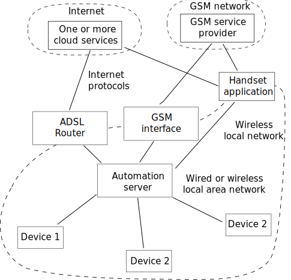

#Roadmap

This document serves as an overview to the home automation design described on this website.  
In completing my system I tried to document the process along the way (mainly as reference for myself, but also to assist others).  In some areas the documentation may be more complete and in other areas less so.  

The system is relatively complex, comprising many different technologies and software tools.  To succeed in reconstructing this project, you would require a working knowledge of the Linux operating system, together with a flair for electronics (but you need not be a specialist in either of these).  

The Internet is exceedingly successful in making information available, and what you see here is not new, just repackaged.  The Internet is however exceedingly weak in configuration and quality control.  In a dynamically changing environment most of the information on the Internet is old and to some extent not fully relevant.  You need to filter and evaluate before accepting Internet-based information.  This set of documents is an attempt to bring together the current information (August 2015).  The  information contained here is also subject to time expiry, it is at best a current snapshot.

##Overview

This repository serves to document my work in building my home automation system using readily available tools and technologies.  There are several well documented examples on the web but, as you probably also experienced, none of these are quite complete in the sense of what I wanted to do.  You would also find these notes lacking, for the same reason.

The point of departure is to use existing tools to the maximum extent; there is no point in repeating what someone else has already done.  To this end, my notes contain links to the web pages I used, together with very brief comments or notes to remind me of what I did.  

When I started on this project I had a reasonably good idea of what I wanted, but had no hardware to work with (except the Raspberry Pi [RPi]). The hardware was ordered, but still floating somewhere in the international mail system.  This forced me to look into architectures and tools before plunging into hardware details.  

##Design options

The main components in the home automation are shown in the diagram above.  Most systems follow this architecture in broad terms, but there may be variations. In the home the automation server integrates the system via a communication network. This network can we wired or wireless.  In both cases there are potentially several different types of communication links, and these links can be mixed types as well.  Of key importance is the automation server's role of communication with the various devices on the network.  These devices include sensors (temperature, humidity, etc.) and controllers (power switches, servo motors, etc.).  The automation server is where it all comes together.  The server communicates to one or more cloud services on the Internet or via the GSM network.  Some home automation systems offer smart phone handset interfaces, which can be accessed via wireless technology on the local area network or on internet protocols via mobile networks.  If the phone is on a local area wireless network, the communication is directly with the automation server.

The home automation marketplace is highly competitive in the commercial as well as the open source spheres. There is no standard today, only stronger and weaker offerings.  The multitude of product offerings makes committing to a specific offering a very difficult call.  I made my calls and report on this, you may have different convictions and needs. To each his own.

You can have a home automation system that does not access the internet or a GSM network in any way.  
Such a system is more secure and much harder to break into, but it limits access to devices located on the local area network.  We did not consider GSM-based systems (e.g., texting) for our implementation.  Commercial and open source offerings for cloud-based automation services abound. Some of the free and open source offerings include:

- openHAB

- ???

The communication options for the local area network between the devices and the server are much wider.  These options include wired connections such as RS485 and ethernet using a great many protocols including TCP/IP, I2C, ISP and many more.

https://github.com/openhab/openhab/wiki/Explanation-of-Items
https://github.com/openhab/openhab/wiki/Explanation-of-Sitemaps

https://github.com/NelisW/myOpenHab/blob/master/docs/000-contents.md

##Design overview
The design employs decentralised hardware units: comprising a server and a number of loose standing sensors/controllers, all on a wireless network.  I used an 802 wifi network, but in principle other wireless protocols could also be used.  Using wireless has a number of benefits: no wires, simplified communication and ease in reconfiguration.

Communication between the units is done by the [MQTT](http://mqtt.org/) (Message Queuing Telemetry Transport) protocol.  MQTT is a light weight protocol that runs on top of TCP/IP, meant for use in machine-to-machine communication.  It uses the publish-subscribe model, and hence requires a broker to act as mediator between the clients that publish messages on a 'topic' or 'channel', and the subscribers that registered an interest in these topics or channels.  Communication is therefore quite simple: clients subscribe/publish to a topic and the broker sees to it that the messages are delivered.  These clients can even be present on the same hardware, they communicate via TCP/IP.  This approach leads to good decoupling, which is a good design principle when it comes to complex systems.  The mosquitto implementation is used here, but any other implementation would serve just as well.

The main server is a Raspberry Pi 2 B, running Rasbpian (a Debian derivative). The hardware is simple and inexpensive, but sufficiently powerful for the task.  Both the hardware and operating system are made by the same organisation, so it simply works, and with little fuss.

The sensors/controllers can employ any required controller technology, provided there is an MQTT service available for the controller.  This project mainly uses ESP8266 wifi controller cards, but  Raspberry Pi, Arduino, or PIC would serve equally well.  The ESP8266 was selected because it offers wifi capability and a reasonably powerful controller all on a single and very inexpensive card.  ESP8266 power use is high, so these controllers are not suitable for battery operation, but in my case this is acceptable.

The integration of all these functions into a powerful home automation system is made possible by the powerful openHAB project.

##File structure

The series of files in the `docs` directory serve to capture my experiences, actions and insights.  A number of smaller files are used, rather than one large file.  Keeping the information in separate files helps to keep things simple and focused.  The files are using markdown for formatting: easily edited by any ACII editor, and equally easily rendered by a number of markdown renderers. 

Files are grouped in number series in order to contain topics together.  The file sequence is more or less chronological, but there is no requirement to strictly follow this sequence. 

It is recommended that you read and construct the RPi, the MQTT and openHAB functionality as a single unit.

- 00x describe various aspects of the Raspberry Pi installation (mainly software)

- 02x describe various aspects of the Raspberry Pi hardware interfaces

- 08x describe the mosquitto MQTT and related tools installation and operation

- 10x describe the installation, set up and use of openHAB.

- 20x describe various clients (Android and web) that may be useful

- 30x describe hardware and software aspects of the ESP8266

- 40x describe the lua language and its use in the ESP8266