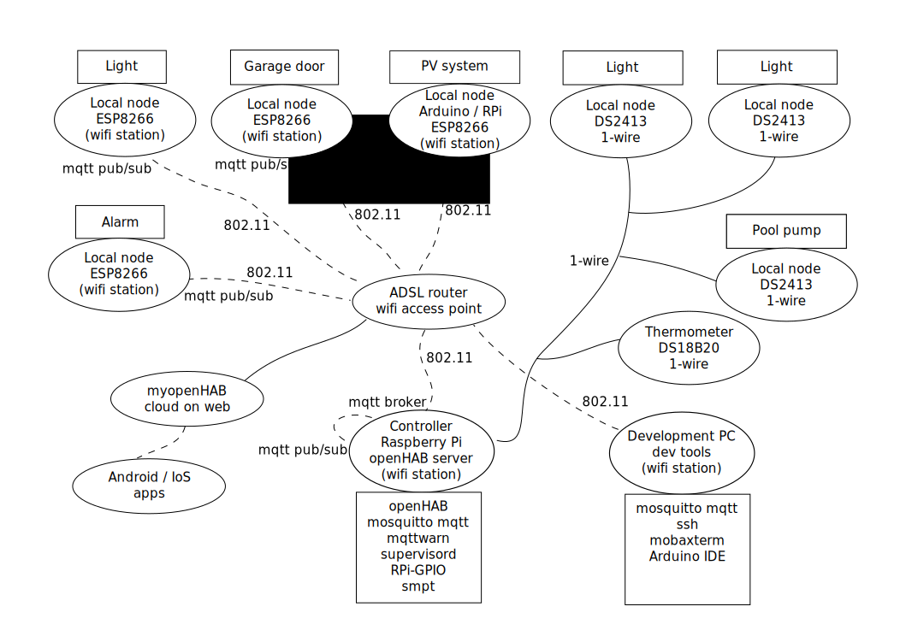

# Quick Start

## Design overview

The design employs decentralised hardware units: comprising a server and a number of loose standing local nodes, on 801.11 wifi wireless or 1-wire networks.  We used an 802.11 wifi network, but in principle other wireless protocols could also be used.  Using wireless has a number of benefits: no wires, simplified communication and ease in reconfiguration.  The wifi access point is a regular ADSL router (connected to the internet), whereas the local stations are wifi stations. In situations where wiring can be be used the 1-wire network is convenient because of the greatly simplified network (only three wires) and laser-labelled devices with unique IDs.

On the 802.11 network the protocol between the units is the [MQTT](http://mqtt.org/) (Message Queuing Telemetry Transport) protocol.  MQTT is a light weight protocol that runs on top of TCP/IP, meant for use in machine-to-machine communication.  It uses a publish-subscribe model, and hence requires a broker (on the central RPi controller) to act as mediator between the clients that publish messages on a 'topic' or 'channel', and the subscribers that registered an interest in these topics or channels.  Communication is therefore quite simple: clients subscribe/publish to a topic and the broker sees to it that the messages are delivered.  These clients can even be present on the same hardware, they communicate via TCP/IP.  This approach leads to ease of testing and good decoupling between the various parts. Decoupling means that system operation is not overly affected by mutual dependency of it parts: only the functionality of the missing parts is lost. Development and testing is greatly simplified, because MQTT messages can easily be generated in a test bed and later replaced with messages from the real hardware. The mosquitto MQTT implementation is used here, but any other implementation would serve just as well.

The main server is a Raspberry Pi 2 B, running Rasbpian (a Debian derivative). The hardware is simple and inexpensive, but sufficiently powerful for the task.  Both the hardware and operating system are made by the same organisation, so it simply works, and with little fuss.

The sensors/controllers can employ any required controller technology, provided there is an MQTT service available for the controller.  This project mainly uses ESP8266 wifi controller cards, but other controllers with some communication protocol would serve equally well.  The ESP8266 was selected because it offers wifi capability and a reasonably powerful controller all on a single and very inexpensive card.  ESP8266 power use is high, so these controllers are not suitable for battery operation, but in my case this is acceptable.

The 1-wire protocol supports an (almost) unlimited number of devices on a simple bus comprising three wires.  Each 1-wire device has a unique 64-bit ID allowing the software to address each device separately.  The protocol is relatively slow, but for IoT and home automation purposes is adequate.  The DC18B20 thermometer is well known and features prominently in RPi and Arduino tutorials. There is also the DS2413 which is a 2-pin IO switch/sensor, which is ideal to switch on/monitor lights.  Unfortunately there is little information on libraries for the DS2413 in the Arduino and RPi forums.

The integration of all these functions into a powerful home automation system is made possible by the powerful openHAB project. The openHAB server runs locally on the the RPi, but can also communicate  to the myopenHAB cloud service (with Android and IoS apps).

## Implementation steps

This is more or less our experimentation sequence. At present there is not much hardware work, this will follow when the hardware arrives.

1. Set up the RPi with Raspbian
1. Set up the PRi for remote access with SSH and set the RPi to login to the default user on boot.
1. Install the development tools of your choice.
1. Install a mail system
1. Install MQTT (e.g., mosquitto)
1. Install and set up mqttwarn to automate notifications.
1. Install supervisor to manage and run Python scripts as daemons.
1. Install the 1-wire library for RPi
1. Set up and experiment with the DS18B20 temperature sensor.
1. Install openHAB and register a used on myopenHAB.
1. Configure the openHAB sitemap and items files to display the temperature
1. Set up and integrate the DS18B20 code, mqttwarn and the openHAB files to work with a web (Andriod) app.
1. Install GPIO for RPi to gain access to the IO pins on the the
1. Build a simple LED blinker and control this with mqtt from mosquitto_pub from a terminal.

## security

https://www.openhomeautomation.net/how-to-keep-hackers-out-of-your-smart-home/

The rest is still under construction.

Note: The system as presented here is currently insecure: no security measures are yet in place.  
