# ESP8266

## Quick Introduction 

[ESP8266 Introduction](http://fabacademy.org/archives/2015/doc/networking-esp8266.html)

There are several different ESP boards available, as documented [here](http://www.happybison.com/reviews/esp8266-based-esp-modules-10/) and [here - read the comments](http://l0l.org.uk/2014/12/esp8266-modules-hardware-guide-gotta-catch-em-all/).  See also [here](http://www.esp8266.com/wiki/doku.php?id=esp8266-module-family).  The ESP01 and ESP12 are by far two most popular.  My recommendation is to use the lolin nodeMCU with the CH340 serial interface.

### Using the Expressif SDK

Not for beginners.

### Lua in the nodeMCU

Not recommended, rather use C in the Arduino Core ESP8266

### Using the Arduino Core ESP8266 libraries

The [Arduino Core ESP8266](https://github.com/esp8266/Arduino) are not Arduino libraries, but ESP8266 libraries written for use in the Ardunio IDE (and other IDEs) that emulate the Arduino library calls. In other words if you are using Arduino modules, it is easy to move to the ESP8266 with these libraries.

[Installing and Building an Arduino Sketch for the $5 ESP8266 Microcontroller](http://makezine.com/2015/04/01/installing-building-arduino-sketch-5-microcontroller/)

[Using the Arduino IDE](http://www.allaboutcircuits.com/projects/breadboard-and-program-an-esp-01-circuit-with-the-arduino-ide/)

Of all the IDE options the [Aruino IDE](https://learn.adafruit.com/adafruit-huzzah-esp8266-breakout/using-arduino-ide) may be the simplest to install and use, but it is not the best. The Arduino Core ESP8266 libraries are also available in the [PlatformIO](http://platformio.org/)-IDE, running in Atom, Sublime text and other editors.  Then there is also the [Arduino plugin for Visual Studio](http://www.visualmicro.com/).  I prefer the [PlatformIO-IDE option](https://github.com/NelisW/myOpenHab/blob/master/docs/413b-ESP8266-PlatformIO-Arduino-Framework.md).

### MicroPython
[MicroPython](https://github.com/micropython/micropython) runs on the ESP8266, see [here](http://docs.micropython.org/en/latest/esp8266/esp8266/quickref.html) for documentation.

### More Information

You can search the internet to find very many examples and details.  Avoid these topics: AT commands, lua programming and most pages on the ESP01. Search for pages on ESP12, nodeMCU, Huzza and Sparkfun.  Only after browsing many such pages will you begin to get a clear picture of the ESP8266 scene.

My own experiences are written up in [this series](https://github.com/NelisW/myOpenHab/tree/master/docs) of giles, from about 410 to 423. Not all the files in this series are nicely written, some only have basic outlines and links, but there should be some useful information in some of these.

### Forums

Look for ESP8266 information on Google+ and Twitter - there some really useful information there.

### Blogs

There are quite a few nice blogs to follow:  

1. [JP Mens](http://jpmens.net/)
2. [Pete Scargill](http://tech.scargill.net/)
3. [Daniel Eichhorn](http://blog.squix.org/)
4. [Jan Penninkhof](http://www.penninkhof.com/esp8266-blogs/)
5. [Notey](http://www.notey.com/blogs/esp8266)

### Detail

[Kolban's book](http://neilkolban.com/tech/esp8266/)

[Specification](https://www.adafruit.com/images/product-files/2471/0A-ESP8266__Datasheet__EN_v4.3.pdf)

[ESP8266 community](http://www.esp8266.com/) is a good source for information.

[Loading new firmware onto an ESP8266](http://www.esp8266.com/wiki/doku.php?id=loading_firmware)

## ESP01

[Setup Guide](http://rancidbacon.com/files/kiwicon8/ESP8266_WiFi_Module_Quick_Start_Guide_v_1.0.4.pdf)

[Firmware upgrade](https://alselectro.wordpress.com/2015/07/28/esp8266-wifi-firmware-upgrading/# comment-1506)

Nice series of articles:  

1. [Getting started with AT commands](https://alselectro.wordpress.com/2015/05/05/wifi-module-esp8266-1-getting-started-with-at-commands/)

2. [Setting up](https://alselectro.wordpress.com/2015/05/13/wifi-module-esp8266-2-tcp-client-server-mode/)

3. [Connect to Android Mobile](https://alselectro.wordpress.com/2015/05/13/wi-fi-module-esp8266-3-connect-to-android-mobile/)

4. [Control from anywhere in the World–Internet of Things](https://alselectro.wordpress.com/2015/05/31/wi-fi-module-esp8266-4-control-from-anywhere-in-the-worldinternet-of-things/)

## ESP12

ESP-12 modules have metal shield with FCC logo on it. It appears these modules are FCC approved (FCC ID: 2ADUIESP-12). The modules have 16 pins and PCB antenna. Similar to ESP-07, some ESP-12 boards have GPIO 4 and 5 switched.  The newer ESP-12-E module adds 5 more half-hole (without extra hole) pins on the side. There are also two more variations of ESP-12-E module: ESP-12-D and ESP-12-Q. Probably referring to Dual and Quad SPI operations for Flash chip because ESP-12-D frees up GPIO 9 and GPIO 10 which are usually occupied for Quad mode SPI operations.
[Getting Started with the ESP8266 ESP-12](http://www.instructables.com/id/Getting-Started-with-the-ESP8266-ESP-12/?ALLSTEPS)

http://blog.falafel.com/programming-gpio-on-the-esp8266-with-nodemcu/

While the ESP8266EX microcontroller itself has 17 GPIO pins, only 11 are available on the ESP8266-12 module because the chip is already connected to external SPI flash memory using some of the pins.

GPIO on the ESP8266EX is multiplexed with other functions, which may limit the availability of pins for GPIO usage. So, for example, while HSPI is enabled, the pins for GPIO12-15 are unavailable for GPIO use, and when you need to connect to the module via the UART, then GPIO1 and GPIO3 are unavailable for GPIO use.

All digital I/O pins are protected from over-voltage by means of a snap-back circuit between the pin and ground. The output devices are also protected from reverse voltages with diodes. This suggests that the ESP may be 5V-tolerant, but official guidance from Espressif says to stick to 3.3V to prevent damaging the chip. Note: [This blogger has  accidentally connected](http://blog.falafel.com/programming-gpio-on-the-esp8266-with-nodemcu/
) 5V to my ESP’s GPIO without any noticeable damage.

[There appears to be](http://internetofhomethings.com/homethings/?p=605) a mixup with pin wiring GPOI4 and GPIO5 pins are interchanged on early ESP12 boards

[ESP-12 spec](https://www.mikrocontroller.net/attachment/243558/fcc_11.pdf)

  

Digital pins 6—11 are not shown on this diagram because they are used to connect flash memory chip on most modules. Trying to use these pins as IOs will likely cause the program to crash.

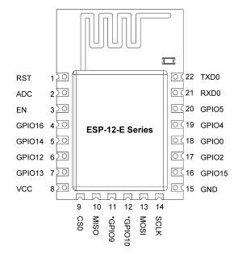

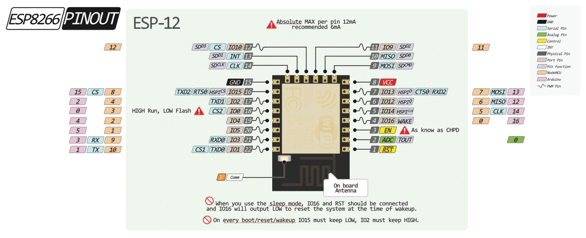

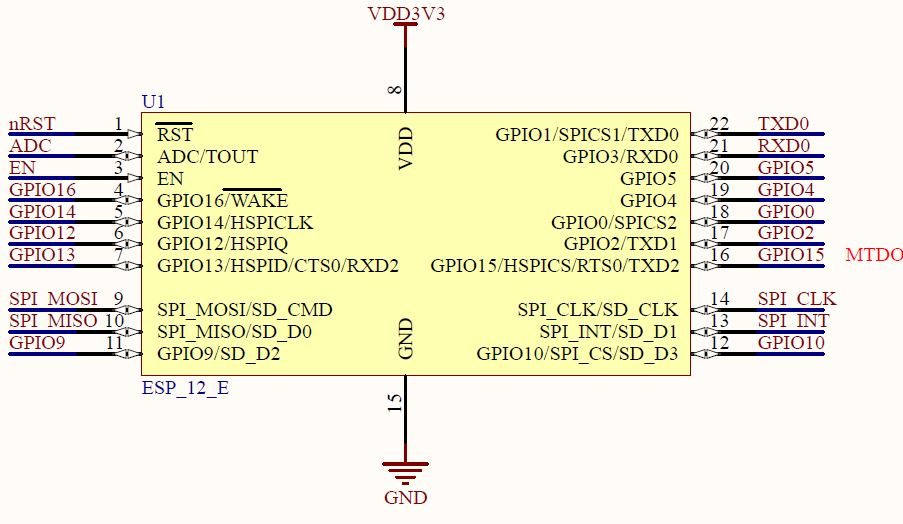

### White ESP12 breakout boards

http://www.electrodragon.com/product/esp8266-smd-adapter-board-wi07-12/    
http://www.esp8266.com/viewtopic.php?f=13&t=3609   

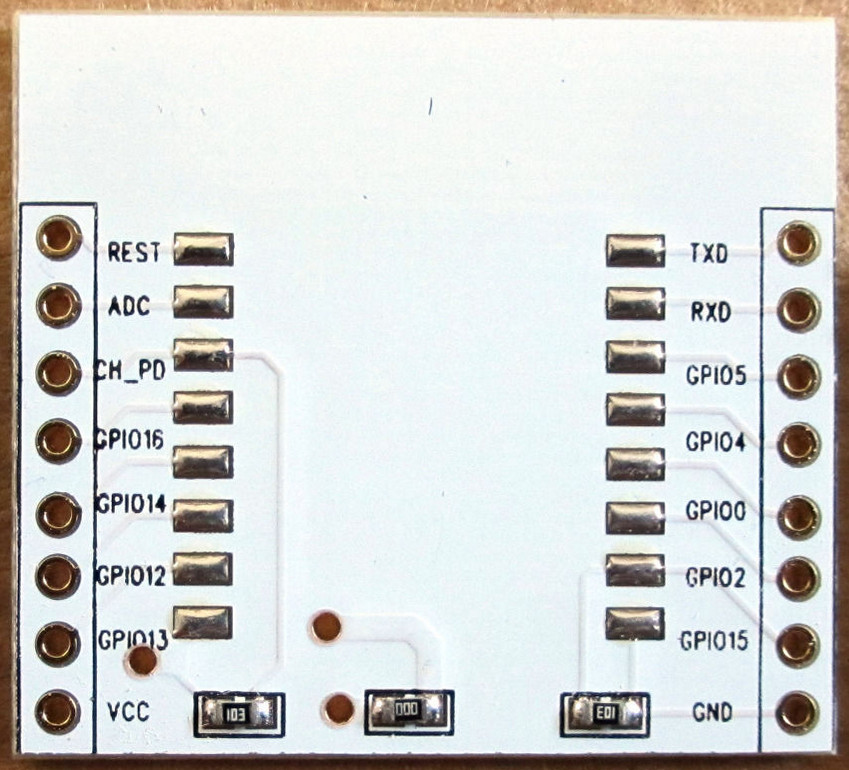  

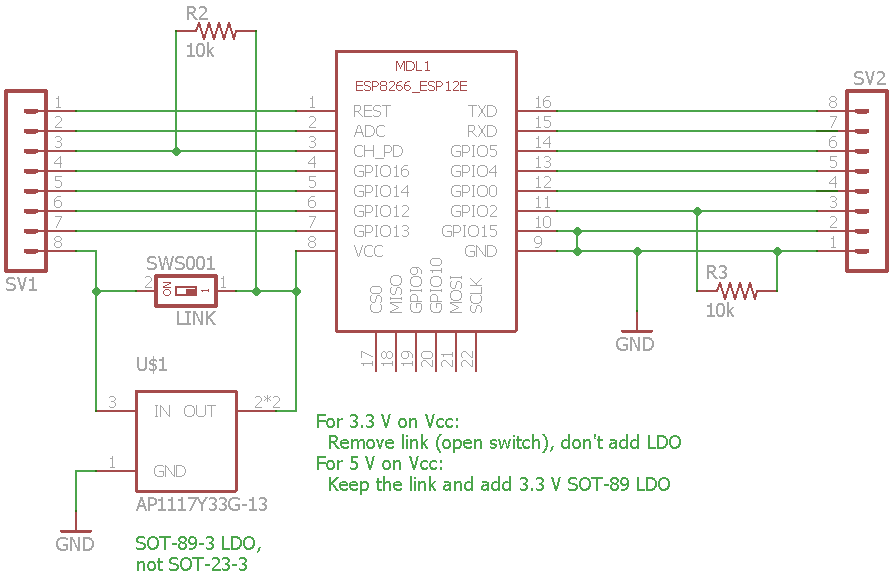

Notes:
1. There is room for an 3.3 V LDO on the back of board (part 6206A 1532/33) in a SOT-89 package (Not a SOT-23!!)
  -  When using 5 V on the Vcc pin, add the LDO and remove the resistor with value `000` in the centre of the board (shown as a switch in the diagram).
  -  When using 3.3 V on Vcc pin, leave the link in place and don't add the LDO on the back.
1. 10K resistor between CHPD and VCC, to enable chip
1. 10K resistor between GPIO2 and GND
1. GPIO15 to GND for normal flash boot mode

## nodeMCU

The [nodeMCU board](http://nodemcu.com/index_en.html)  is a good place to begin learning about the ESP8266. [The NodeMCU board](http://embeddedcomputing.weebly.com/nodemcu-board.html) is based on an ESP8266-12 but features a built-in serial over USB interface, 2 buttons (flash and reset), 2 LEDs, and adequate power supply decoupling.  It features more  GPIOs, of which
-  9 digital GPIOs operating at 3.3V
- one analog GPIO, with full scale range of 1.8 The Expressif chip has a full scale input range 1 V, but the nodeMCU has a voltage divider, up to 1.8 V.
There is a good [technical overview  here](https://nurdspace.nl/ESP8266).
The [nodeMCU](nodemcu.com/index_en.html) is an open source development.

There are quite a few different development environments to consider:
1. Using the lua interpreter that is pre-installed in the nodeMCU firmware.
2. Using C in the Arduino IDE environment. The IDE and libraries are well developed.
3. Using C in the [gcc toolchain](https://github.com/esp8266/esp8266-wiki/wiki).
4. Using the old-style modem AT commands to effect communication - no lua or C programming required, but also limited in scope.
3. Using Python, but the [MicroPython on ESP8266](https://github.com/micropython/micropython/tree/master/esp8266)
with documentation [here](http://docs.micropython.org/en/latest/esp8266/).

[Programming GPIO on the ESP8266 with NodeMCU](http://blog.falafel.com/programming-gpio-on-the-esp8266-with-nodemcu)

Hardware variants:
- The NodeMCU V0.9 (brown PCB) uses the CH340 serial to USB programmer chip (needs a specific driver).  
- The nodeMCU V1 (green PCB) uses the CP2102 serial programmer chip.  
- The nodeMCU V2 - no information.  
- The [nodeMCU V3 LoLin](http://www.aliexpress.com/store/product/New-Wireless-module-NodeMcu-Lua-WIFI-Internet-of-Things-development-board-based-ESP8266/1331105_32307066449.html) uses the CH340G serial programmer chip (see the file `412-ESP8266-connect-serial-board.md` on how to install the driver).  
- [Adafruit Huzzah](https://learn.adafruit.com/adafruit-huzzah-esp8266-breakout/using-arduino-ide) supports nodeMCU firmware but does not have an integrated USB serial capability.  The pin layout is also different from the other nodeMCU boards.  

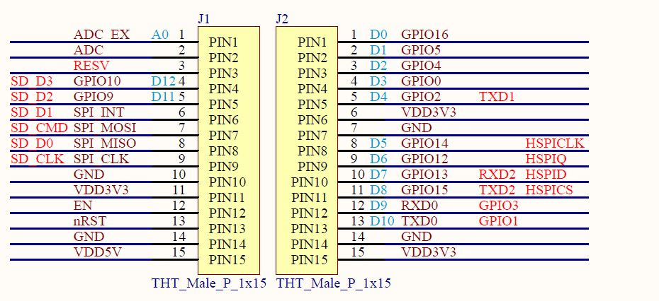

### nodeMCU V1

The V1 pin definitions shown below, with documentation [here](https://github.com/nodemcu/nodemcu-devkit-v1.0).

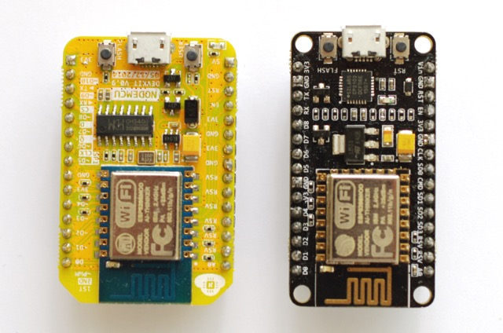

### LoLin nodeMCU V3
[LoLin](http://www.wemos.cc/wiki/) is based on nodeMCU. It has software support for the embedded lua language, with built-in json, file, timer, pwm, i2c, spi, 1-wire, net, mqtt, coap, gpio, wifi, adc, uart and system api. Both Integer version(less memory usage) and Float version(Default) firmware provided. The pin definition for the LoLin board is given [here](http://www.wemos.cc/wiki/Hardware/Pin), with additional information on the [wemos D1 here](http://www.wemos.cc/d1/Hardware).

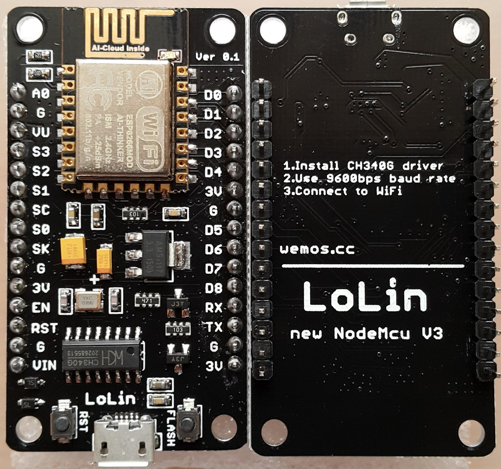

## Operating modes

ESP8266 WIFI module can operate in three modes:

- ST  – Station mode in which ESP acts as a device & connects to an existing Access point.

- AP – Access Point mode where the ESP itself acts as AP & other devices like Mobile can connect to it.

- Both – ST & AP both mode is allowed in ESP.The mode of operation is set by the AT command

Remember to secure the ESP8266 if used in access point mode to prevent hacking into your network.

## Flash GPIO pins – GPIO6 to GPIO11
http://www.forward.com.au/pfod/ESP8266/GPIOpins/index.html

Most ESP8266 boards have a flash chip connected to some or all of GPIO6-GPIO11. Most programs use flash memory, as well as RAM, so unless you specifically make sure your code only runs from RAM, you can't use these pins for other purposes.

The exact number of pins used in the range GPIO6 to GPIO11 depends on the type of flash hardware used on your module. Quad IO uses 4 lines for data (6 pins total) for up to 4 times the speed of standard. Dual IO uses 2 lines for data (4 pins total) Standard uses a single line for data ( 3 pins total).

Unless you know exactly what your board requires, you are best to just ignore GPIO6 to GPIO11 and do not refer to them from your code.

## ESP8266 boot up modes
See [here](https://github.com/esp8266/esp8266-wiki/wiki/Boot-Process# esp-boot-modes) and [here](http://www.forward.com.au/pfod/ESP8266/GPIOpins/index.html).  The Espressif code can boot in different modes, selected on power-up based on GPIO pin levels. (MTDO is equivalent to GPIO15).  

|GPIO15 / MTDO 	|GPIO0 	|GPIO2 	|Mode 	Description|
|--|--|--|--|
|L 	|L 	|H |Programming download via UART|
|L |H 	|H 	|Normal operation, boot from SPI Flash|
|H 	|x 	|x 	|SDIO 	Boot from SD-card|

The settings of these inputs is only checked during the power up (or reset) of the chip. After that the pins are available for general use, but  restricted by these external pull up/down resistors.

Pull-up and pull-down resistors can be in the range 2k to 10k. A 2k resistor gives better noise immunity.

## Upsing GPIO0, GPIO2 and GPIO16

See [here](http://www.forward.com.au/pfod/ESP8266/GPIOpins/index.html
) for a detailed description.

For normal boot-up the GPIO0, GPIO2 and GPIO16 pins will already have a resistor connected to either VCC (GPIO0 and GPIO2) or GND for GPIO15. This determines how any external device, like a relay or led+resistor, must be connected.  In general, you cannot just attach an external switch to the these pins because at power up you usually cannot guarantee the switch will not be pulling the input to ground and so prevent the module from starting correctly.

## Flash quality
[Flash memory problems](http://internetofhomethings.com/homethings/?p=396):  "we know the flash chip (25Q40) used with many of these ESP8266 module is of low quality and fails after only a few flash cycles. Perhaps sending the code somewhere that it never returns from. Triggering the watchdog timer to reset the unit."

## Power supply issues:
1.  The general advice is that the ESP8266 must be run of a power supply with at least 300 to 500 mA  capacity.  Furthermore, decoupling and supply capacitors are advised.  

2.  Put a large electrolytic capacitor on the power supply near the ESP, recommended values range from 10 uF to 470 uF depending on where you read.

3. Put a decoupling capacitor across the Vcc to Gnd pins, within 10 mm from the pins. Recommended values are 100 nF.

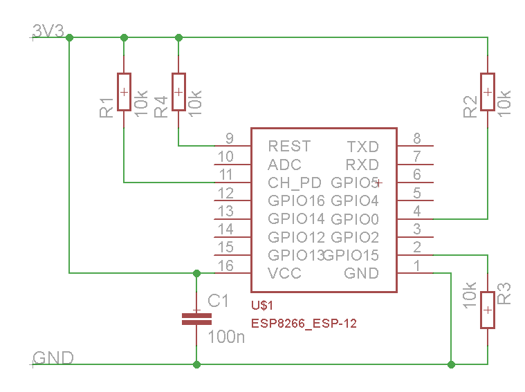

See the following websites:  
http://www.analog.com/media/en/training-seminars/tutorials/MT-101.pdf  
http://www.esp8266.com/viewtopic.php?f=6&t=497  
http://internetofhomethings.com/homethings/?p=605  
http://internetofhomethings.com/homethings/?p=396  
https://www.reddit.com/r/esp8266/comments/31gfre/just_me_or_are_the_esp8266s_flakey_as_fck/  
http://bbs.espressif.com/viewtopic.php?t=1078  

## Supply current

There is a general warning out that a sufficiently large power supply must be used (500 mA plus) because the ESP is quite hungry when transmitting. The ESP also has low power sleep mode operation but most boards do not implement this currently.

Measured the positive supply voltage showed the following 280 mV spikes on the nodeMCU board, after it has been down regulated to 3.3 volt:

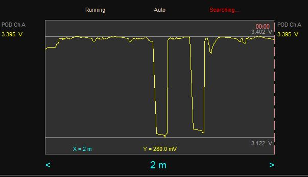

It is not easy to filter the supply voltage on the 5V side of the regulator because the power is fed in on a USB connector and the 5V line is not easily accessible.  The two 3.3 V rails on the breadboard were both decoupled with a 150 nF and 100 uF capacitors (which is not the ideal location, you want to do this on the 5V supply before the regulator).  This dropped the spikes to around 40 mV, still causing the occasional false alarm - too many false alarms in fact.

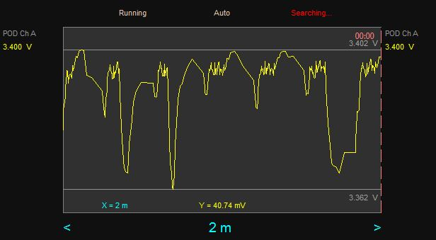

When the decoupled circuit is powered from my laptop, the spikes are of the order of 14 mV, and then the alarm is quite quiet.

Study the PIR schematic diagram and you will note two high capacity filtering capacitors: one at the output of the regulator and another near the detector.   The capacitor near the detector is in fact in a low-pass filter configuration with the voltage divider.  This should tell us that the device is sensitive to supply voltage noise.

The nature of the spikes are quite interesting.  The same pattern appears on both the Samsung supply and the laptop supply (but to a far lesser extend on the laptop).  We can therefore conclude that it is caused by the nodeMCU board.  The deep spikes occurs every 20 seconds or so. Perhaps there is some process taking place at this interval that sinks a significant current in the ESP8266?

I measured the current consumption of a nodeMCU board by placing a 1.5 Ohm series resistor in the supply line.  The power supply used was a very small footprint AC/DC 5V 700mA board bought on EBay.  The no-load supply voltage was within spec and the ripple was reasonably small (less than 20 mV), but with occasional very short spikes.

Driving the nodeMCU the power supply performance was quite poor, even after decoupling with 100 nF and 75 uF capacitors.   The following graph shows a time recording of the current: average value around 271mV/1.5 Ohm=180 mA, which is in agreement with what I read elsewhere. However, there were spikes of 100mW/1.5Ohm=65mA peak-to-peak.  Clearly the PIR might be triggered by these large peaks!

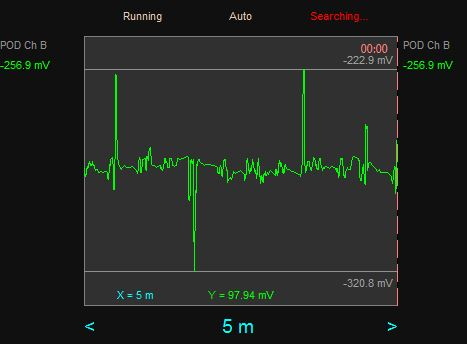

See [here](https://github.com/NelisW/myOpenHab/blob/master/docs/701-PIR-sensors.md) for more detail on the use of a linear regulator to filter out the ESP-induced noise.

## Deep sleep
https://github.com/z2amiller/sensorboard/blob/master/PowerSaving.md

## Introduction - other links

### AT commands

I don't recommend you use AT commands, it is too limiting.

[Getting started with the ESP8266: AT commands only](http://www.esp8266.com/wiki/doku.php?id=getting-started-with-the-esp8266)

[Update the Firmware in Your ESP8266 Wi-Fi Module AT commands](http://www.allaboutcircuits.com/projects/update-the-firmware-in-your-esp8266-wi-fi-module/)

## Diverse links

[ESP8266 Wemos D1 mini](https://primalcortex.wordpress.com/tag/sming/)

[ESP8266 Programming Jig (for ESP-01) ](https://www.hackster.io/glowascii/esp8266-programming-jig-5afd03)

[DIT ESP01 motherboard](http://www.nfriedly.com/techblog/2015/07/build-a-diy-esp8266ex-esp-01-dev-test-programming-board/)

[Esp8266 firmware update](http://www.instructables.com/id/Intro-Esp-8266-firmware-update/)

[Building a battery powered ESP8266](https://www.agocontrol.com/2015/03/building-a-battery-powered-wifi-iot-sensor-with-esp8266-ms-5611-gy-63-nodemcu-and-mqtt/)

[Low Power ESP8266 – Sleeping at 78 micro Amps](http://tim.jagenberg.info/2015/01/18/low-power-esp8266/)
