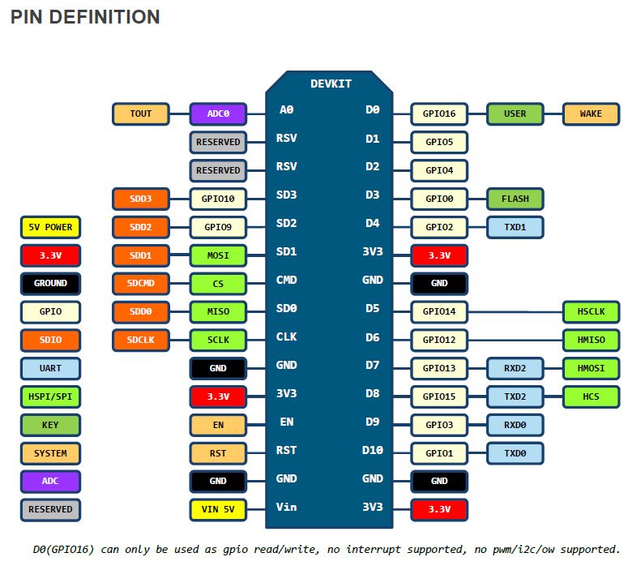

# ESP8266

## Introduction

[Specification](https://www.adafruit.com/images/product-files/2471/0A-ESP8266__Datasheet__EN_v4.3.pdf)

[ESP8266 community](http://www.esp8266.com/) is a good source for information.

There are several different ESP boards available, as documented [here](http://www.happybison.com/reviews/esp8266-based-esp-modules-10/) and [here - read the comments](http://l0l.org.uk/2014/12/esp8266-modules-hardware-guide-gotta-catch-em-all/).  See also [here](http://www.esp8266.com/wiki/doku.php?id=esp8266-module-family).  The ESP01 and ESP12 are by far two most popular.

[Getting started with the ESP8266](http://www.esp8266.com/wiki/doku.php?id=getting-started-with-the-esp8266)

[Loading new firmware onto an ESP8266](http://www.esp8266.com/wiki/doku.php?id=loading_firmware)

[ESP8266 Introduction](http://fabacademy.org/archives/2015/doc/networking-esp8266.html)

[Installing and Building an Arduino Sketch for the $5 ESP8266 Microcontroller](http://makezine.com/2015/04/01/installing-building-arduino-sketch-5-microcontroller/)

[ESP8266 Wemos D1 mini](https://primalcortex.wordpress.com/tag/sming/)

[ESP8266 Programming Jig (for ESP-01) ](https://www.hackster.io/glowascii/esp8266-programming-jig-5afd03)

[DIT ESP01 motherboard](http://www.nfriedly.com/techblog/2015/07/build-a-diy-esp8266ex-esp-01-dev-test-programming-board/)
[Esp8266 firmware update](http://www.instructables.com/id/Intro-Esp-8266-firmware-update/)

[Update the Firmware in Your ESP8266 Wi-Fi Module](http://www.allaboutcircuits.com/projects/update-the-firmware-in-your-esp8266-wi-fi-module/), see also the [first part-(http://www.allaboutcircuits.com/projects/breadboard-and-program-an-esp-01-circuit-with-the-arduino-ide/)

[Building a battery powered ESP8266](https://www.agocontrol.com/2015/03/building-a-battery-powered-wifi-iot-sensor-with-esp8266-ms-5611-gy-63-nodemcu-and-mqtt/)

[Low Power ESP8266 – Sleeping at 78 micro Amps](http://tim.jagenberg.info/2015/01/18/low-power-esp8266/)

[nodeMCU](http://nodemcu.com/index_en.html) is an ESP8266 installed  a development board that includes a USB download interface, more pins broken out and adequate power supply decoupling.  The nodeNCU board is a good place to begin learning about the ESP8266.

There are quite a few different development environments to consider:
1. Using the lua interpreter that is pre-installed in the nodeMCU firmware.
2. Using C in the Arduino IDE environment. The IDE and libraries are well developed.
3. Using C in the [gcc toolchain](https://github.com/esp8266/esp8266-wiki/wiki).
4. Using the old-style modem AT commands to effect communication - no lua or C programming required, but also limited in scope.
3. Using Python, but the [MicroPython on ESP8266](https://learn.adafruit.com/building-and-running-micropython-on-the-esp8266)) tools are not yet well developed.

There is a good [technical overview  here](https://nurdspace.nl/ESP8266).

## nodeMCU
### Introduction
A brief [introduction](http://embeddedcomputing.weebly.com/nodemcu-board.html) states: "The NodeMCU board is based on an ESP8266-12 but features a built-in serial over USB interface and other amenities like 2 buttons and 2 LEDs.  The board can be programmed using the Wiring / Arduino framework as the other ESP8266 boards.  It features more available GPIOs, of which
-  9 digital GPIOs operating at 3,3V
- one analog GPIO, albeit limited to 1.8 V (note that there is a voltage divider on the input pin.)

The [nodeMCU](nodemcu.com/index_en.html) is an open source development, with V1 documented (here)[https://github.com/nodemcu/nodemcu-devkit-v1.0]

Hardware variants:
- The NodeMCU V0.9 (brown PCB) uses the CH340 serial to USB programmer chip (needs a specific driver).  
- The nodeMCU V1 (green PCB) uses the CP2102 serial programmer chip.  
- The nodeMCU V2 - no information.  
- The [nodeMCU V3 LoLin](http://www.aliexpress.com/store/product/New-Wireless-module-NodeMcu-Lua-WIFI-Internet-of-Things-development-board-based-ESP8266/1331105_32307066449.html) uses the CH340G serial programmer chip (see the file `412-ESP8266-connect-serial-board.md` on how to install the driver).  
- [Adafruit Huzzah](https://learn.adafruit.com/adafruit-huzzah-esp8266-breakout/using-arduino-ide) supports nodeMCU but does not have an integrated USB serial capability.  The pin layout is also different from the other nodeMCU boards.  

### nodeMCU V1

The V1 pin definitions are as follows:

### LoLin nodeMCU V3

[LoLin](http://www.wemos.cc/wiki/) is based on nodeMCU. It has software support for the embedded lua language, with built-in json, file, timer, pwm, i2c, spi, 1-wire, net, mqtt, coap, gpio, wifi, adc, uart and system api. Both Integer version(less memory usage) and Float version(Default) firmware provided.

Howver, if you use the Arduino IDE the built-in firmware is overwritten by the Arduino libraries.

The pin definition for the LoLin board is given [here](http://www.wemos.cc/wiki/Hardware/Pin), with additional information on the [wemos D1 here](http://www.wemos.cc/d1/Hardware).

### ESP12

Digital pins 6—11 are not shown on this diagram because they are used to connect flash memory chip on most modules. Trying to use these pins as IOs will likely cause the program to crash.

### White breakout boards

http://www.electrodragon.com/product/esp8266-smd-adapter-board-wi07-12/   

1.    Reserved LDO place on the back of board
1.    10K resistor between CHPD and VCC, to enable chip
1.    10K resistor between GPIO2 and GND
1.    GPIO15 to GND for normal flash boot mode

http://www.esp8266.com/viewtopic.php?f=13&t=3609   

shorting Vcc to VIN through what seems to be a 0k resistor (labelled 000 and measures direct with a multimeter)????  It's there, so you can use the board without a LDO. If you mount a LDO, you need to remove that resistor.

If you connect 3.3v to vcc the board works fine. You can put a voltage reg onto the position on the back of the board to power it at 5v. I bought the ams1117? But they are the wrong pinout for that position.
All was not lost as you can use it by cutting a track and positioning carefully. Not recommended though.
I now use an offboard regulator on vero board as I needed multiple gnd and vcc points.

http://tronixlabs.com.au/wireless/esp8266/esp8266-smd-adaptor-board-australia/  
Please note - the labelling is incorrect on the right-hand side of the board. It should be TXD, RXD, GPIO4, GPIO5, GPIO0, GPIO1, GPIO15, GND.

http://www.ebay.co.uk/itm/171822251755  
Fixes incorrectly labelled pin assignments.

It incorporates all the pull-up/down circuitry required to put your ESP8266 into normal operating mode. Just solder your ESP8266 module on, supply 2.7 - 3.6 volts (3.3v nominal) across the VCC and GND pins and away you go!

It also has pads on the underside to accept a SOT-89 3.3v voltage regulator. (In a pinch, I've used a cheap SOT-23 AMS1117 instead, though it's a bit too big really.)
(Note: There's a jumper on the top side that needs to be removed if a voltage regulator is installed - it's the central SMD component, marked "000".)

## C on the Arduino IDE

[Arduino code for ESP8266](https://github.com/esp8266/Arduino)

[Introduction to nodeMCU on Arduino IDE](http://embeddedcomputing.weebly.com/nodemcu-board.html)

### AT commands
ESP01, in it’s default configuration, boots up into the serial modem mode. In this mode you can communicate with it using a set of [AT](https://room-15.github.io/blog/2015/03/26/esp8266-at-command-reference/) commands.  ESP8266 expects <CR><LF> or CarriageReturn and LineFeed at the end of each command, but just<CR> seems to work too.

## Web-based ESP environments

A somewhat confusing [post](http://www.instructables.com/id/ESP8266-based-web-configurable-wifi-general-purpos-1/)

The [ESPEasy project](http://www.esp8266.nu/index.php/Main_Page)

## Miscellaneous projects

<http://horaciobouzas.com/> has a number of project posts, some of which are in the amateur radio context.  The author also sells PCBs for some of his projects.

[Connecting two ESP8266](http://randomnerdtutorials.com/how-to-make-two-esp8266-talk/), one as access point and one as station

[Using Blynk with ESP8266-as-Arduino-Uno-wifi](http://www.instructables.com/id/Connect-to-Blynk-using-ESP8266-as-Arduino-Uno-wifi/)

[Wireless logger ESP8266 NodeMCU v1.0 with Arduino IDE](http://www.instructables.com/id/ESP8266-NodeMCU-v10-ESP12-E-with-Arduino-IDE/)

## Miscellaneous hardware notes

### ESP-01
[Boot modes](https://github.com/esp8266/esp8266-wiki/wiki/Boot-Process)

[Setup Guide](http://rancidbacon.com/files/kiwicon8/ESP8266_WiFi_Module_Quick_Start_Guide_v_1.0.4.pdf)

[Firmware upgrade](https://alselectro.wordpress.com/2015/07/28/esp8266-wifi-firmware-upgrading/# comment-1506)

Nice series of articles:  

1. [Getting started with AT commands](https://alselectro.wordpress.com/2015/05/05/wifi-module-esp8266-1-getting-started-with-at-commands/)

2. [Setting up](https://alselectro.wordpress.com/2015/05/13/wifi-module-esp8266-2-tcp-client-server-mode/)

3. [Connect to Android Mobile](https://alselectro.wordpress.com/2015/05/13/wi-fi-module-esp8266-3-connect-to-android-mobile/)

4. [Control from anywhere in the World–Internet of Things](https://alselectro.wordpress.com/2015/05/31/wi-fi-module-esp8266-4-control-from-anywhere-in-the-worldinternet-of-things/)

5. [ESP8266 boot up modes](https://github.com/esp8266/esp8266-wiki/wiki/Boot-Process# esp-boot-modes)

The Espressif code can boot in different modes, selected on power-up based on GPIO pin levels. (MTDO is equivalent to GPIO15).  

|MTDO 	|GPIO0 	|GPIO2 	|Mode 	Description|
|--|--|--|--|
|L 	|L 	|H |UART 	Download code from UART|
|L |H 	|H 	|Flash 	Boot from SPI Flash|
|H 	|x 	|x 	|SDIO 	Boot from SD-card|

you do want GPIO15 pulled low on chip boot, and you want GPIO2 pulled high

### ESP-12 series
ESP-12 modules have metal shield with FCC logo on it. It appears these modules are FCC approved (FCC ID: 2ADUIESP-12). The modules have 16 pins and PCB antenna. Similar to ESP-07, some ESP-12 boards have GPIO 4 and 5 switched.  The newer ESP-12-E module adds 5 more half-hole (without extra hole) pins on the side. There are also two more variations of ESP-12-E module: ESP-12-D and ESP-12-Q. Probably referring to Dual and Quad SPI operations for Flash chip because ESP-12-D frees up GPIO 9 and GPIO 10 which are usually occupied for Quad mode SPI operations.
[Getting Started with the ESP8266 ESP-12](http://www.instructables.com/id/Getting-Started-with-the-ESP8266-ESP-12/?ALLSTEPS)

[ESP-12 spec](https://www.mikrocontroller.net/attachment/243558/fcc_11.pdf)

### nodeMCU

The [nodeMCU](http://nodemcu.com/index_en.html# fr_54747661d775ef1a3600009e) uses the ESP-12, but provides additional hardware around the ESP-12:  

### Olimex
[Olimex ESD8266-Dev, SDIO mode, UART mode and FLASH mode.](https://www.olimex.com/Products/IoT/MOD-WIFI-ESP8266-DEV/resources/MOD-WIFI-ESP8266-DEV_jumper_reference.pdf)

## Operational modes

ESP8266 WIFI module can operate in three modes:

- ST  – Station mode in which ESP acts as a device & connects to an existing Access point.

- AP – Access Point mode where the ESP itself acts as AP & other devices like Mobile can connect to it.

- Both – ST & AP both mode is allowed in ESP.The mode of operation is set by the AT command

Remember to secure the ESP8266 if used in access point mode to prevent hacking into your network.

## Hardware issues and instability.

### Pin errors
[There appears to be](http://internetofhomethings.com/homethings/?p=605) a mixup with pin wiring GPOI4 and GPIO5 pins are interchanged on early ESP12 boards

### Flash quality
[Flash memory problems](http://internetofhomethings.com/homethings/?p=396):  "we know the flash chip (25Q40) used with many of these ESP8266 module is of low quality and fails after only a few flash cycles. Perhaps sending the code somewhere that it never returns from. Triggering the watchdog timer to reset the unit."

### Power supply issues:
1.  The general advice is that the ESP8266 must be run of a power supply with at least 300 to 500 mA  capacity.  Furthermore, decoupling and supply capacitors are advised.  

2.  Put a large electrolytic capacitor on the power supply near the ESP, recommended values range from 10 uF to 470 uF depending on where you read.

3. Put a decoupling capacitor across the Vcc to Gnd pins, within 10 mm from the pins. Recommended values are 100 nF.

See the following websites:  
http://www.analog.com/media/en/training-seminars/tutorials/MT-101.pdf  
http://www.esp8266.com/viewtopic.php?f=6&t=497  
http://internetofhomethings.com/homethings/?p=605  
http://internetofhomethings.com/homethings/?p=396  
https://www.reddit.com/r/esp8266/comments/31gfre/just_me_or_are_the_esp8266s_flakey_as_fck/  
http://bbs.espressif.com/viewtopic.php?t=1078  

### Supply current

There is a general warning out that a sufficiently large power supply must be used (500 mA plus) because the ESP is quite hungry when transmitting. The ESP also has low power sleep mode operation but most boards do not implement this currently.

Measured the positive supply voltage showed the following 280 mV spikes on the nodeMCU board, after it has been down regulated to 3.3 volt:

It is not easy to filter the supply voltage on the 5V side of the regulator because the power is fed in on a USB connector and the 5V line is not easily accessible.  The two 3.3 V rails on the breadboard were both decoupled with a 150 nF and 100 uF capacitors (which is not the ideal location, you want to do this on the 5V supply before the regulator).  This dropped the spikes to around 40 mV, still causing the occasional false alarm - too many false alarms in fact.

When the decoupled circuit is powered from my laptop, the spikes are of the order of 14 mV, and then the alarm is quite quiet.

Study the PIR schematic diagram and you will note two high capacity filtering capacitors: one at the output of the regulator and another near the detector.   The capacitor near the detector is in fact in a low-pass filter configuration with the voltage divider.  This should tell us that the device is sensitive to supply voltage noise.

The nature of the spikes are quite interesting.  The same pattern appears on both the Samsung supply and the laptop supply (but to a far lesser extend on the laptop).  We can therefore conclude that it is caused by the nodeMCU board.  The deep spikes occurs every 20 seconds or so. Perhaps there is some process taking place at this interval that sinks a significant current in the ESP8266?

I measured the current consumption of a nodeMCU board by placing a 1.5 Ohm series resistor in the supply line.  The power supply used was a very small footprint AC/DC 5V 700mA board bought on EBay.  The no-load supply voltage was within spec and the ripple was reasonably small (less than 20 mV), but with occasional very short spikes.

Driving the nodeMCU the power supply performance was quite poor, even after decoupling with 100 nF and 75 uF capacitors.   The following graph shows a time recording of the current: average value around 271mV/1.5 Ohm=180 mA, which is in agreement with what I read elsewhere. However, there were spikes of 100mW/1.5Ohm=65mA peak-to-peak.  Clearly the PIR might be triggered by these large peaks!

See [here](https://github.com/NelisW/myOpenHab/blob/master/docs/701-PIR-sensors.md) for more detail on the use of a linear regulator to filter out the ESP-induced noise.

## Diverse Projects

<http://randomnerdtutorials.com/7-weekend-projectstutorials-for-the-esp8266-wifi-module/>

<http://randomnerdtutorials.com/how-to-control-your-esp8266-from-anywhere-in-the-world/>
