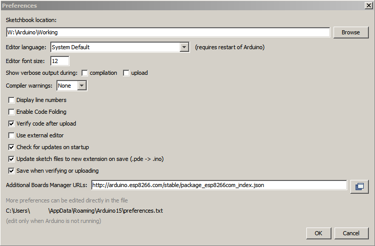

# ESP8266 on Windows 7 with Arduino IDE

[Arduino code for ESP8266](https://github.com/esp8266/Arduino)

[Introduction to nodeMCU on Arduino IDE](http://embeddedcomputing.weebly.com/nodemcu-board.html)

## Install Arduino IDE

**Note** In the context of the ESP8266, the term 'Arduino IDE' can be used in two meanings: (1) the developer environment and (2) the core libraries developed for use in the development environment.
The original Arduino core libraries were developed to program the Arduino microcontrollers, but the ESP8266 developers created an ESP8266 core library API that very strongly resembles the Arduino API.  This means that the software developed for the ESP8266 with the Arduino ESP8266 core library has very much the same look and feel as the code developed for the Arduino itself.  There obviously are differences, but the similarity in the core API is high.  The differences arise in the non-core libraries, scuh as the wifi libraries, etc.

This document describes the use of the Arduino IDE software and core ESP8266 libraries to program and flash the ESP8266.  The Arduino IDE core libraries can also be used in other development environments.  One such development environment is the [platformio-ide](https://github.com/NelisW/myOpenHab/blob/master/docs/413b-ESP8266-PlatformIO-Arduino-Framework.md).

The Arduino IDE can be used to build and download ESP8266 software.  The [GitHub repo](https://github.com/esp8266/Arduino) for the project describes it as  follows: "This project brings support for ESP8266 chip to the Arduino environment. It lets you write sketches using familiar Arduino functions and libraries, and run them directly on ESP8266, no external microcontroller required. ESP8266 Arduino core comes with libraries to communicate over WiFi using TCP and UDP, set up HTTP, mDNS, SSDP, and DNS servers, do OTA updates, use a file system in flash memory, work with SD cards, servos, SPI and I2C peripherals."

<https://github.com/esp8266/Arduino/blob/master/doc/reference.md>  Reference

At the time of writing the IDE version is 1.6.7.

<https://github.com/esp8266/Arduino/blob/master/README.md>  how-to install.  
<http://randomnerdtutorials.com/how-to-install-esp8266-board-arduino-ide/>
<http://www.instructables.com/id/ESP8266-ESP-12Standalone-Blynk-101/>    
<http://www.instructables.com/id/ESP8266-Arduino-IDE-164-Portable-Full-Quick-Instal/>    
<http://www.esp8266-projects.com/2015/06/esp8266-arduino-ide-v164-portable.html>  

1. You have to have an internet connection to execute the procedure below.
1. Download and install the Arduino IDE from here: <https://www.arduino.cc/en/Main/Software>.
 -  You can download the exe for installation as a regular Windows application.
 -  Alternatively you can create a portable installation by  downloading the zip file and unzipping in the directory of your choice.  This directory may be on a USB memory device for portability.
 -  Either way, the IDE will create a directory in your user home directory, something like `C:\Users\YourUserName\AppData\Roaming\Arduino15`
2. The exe install will create all the shortcuts automatically.  If you downloaded and unzipped the zip file, Windows will not know of the software. Create a shortcut to the IDE and place it in QuickLaunch or in the Start Menu.
2. Create directory where you want to place all your working files.  This can be anywhere on your PC.  
3. Open the IDE and navigate to the *Files > Preferences* dialog box.  Copy the location of your working directory into the edit box that is marked with `Sketchbook location` (top of the following picture).

  
3. While in the preferences dialog, note the location on your PC where the IDE stores your user-specific information, right at the bottom of the dialog window.  There is a `preferences.txt` file where you can set additional preferences that are not presented in the dialog box.

4. Install the ESP8266 support for IDE:  

- Open the Arduino IDE and navigate to *File > Preferences*

- In the *Additional boards manager URLs* paste this link:  <http://arduino.esp8266.com/stable/package_esp8266com_index.json>. Click the OK button to close the dialog box.  You will do well to regularly check for updates to these files, development takes place at a brisk pace.  The GitHub repo for the first library is at <https://github.com/esp8266/Arduino>, which has links to the [documentation](https://github.com/esp8266/Arduino/blob/esp8266/hardware/esp8266com/esp8266/doc/reference.md) and the list of [supported boards](https://github.com/esp8266/Arduino/blob/esp8266/hardware/esp8266com/esp8266/doc/boards.md), which also has some hints on using the various ESP boards.  This IDE board extension provides a well-integrated development environment for the ESP8266 (assuming you want to use the C-language libraries).

- Navigate to *Tools > Board* and then click on *Board Manager...*. A new dialog box will open. Scroll down to the ESP8266 entry, click on it and click *Install*. The IDE will now download the ESP board definitions (this software is not part of the Arduino IDE product offering, but uses the Arduino IDE's ability to load new board definitions).  

- After the installation is complete the version number should be shown, together with all the new board definitions contained in the package. Depending on the version you downloaded the board definitions may be different from the list shown here.
   

- Once the board definitions are installed they will be available as selections on the Boards menu entry, as shown here:

  

5. Install the ESP8266 File System IDE tool, as described [here](https://github.com/esp8266/Arduino/blob/esp8266/hardware/esp8266com/esp8266/doc/reference.md# uploading-files-to-file-system).  This tool is used to upload files to the ESP flash file system.

6. If you have the [nodeMCU V3.0 lolin](http://www.wemos.cc/d1/Getting_Started) ESP8266 board
-  Paste the link <https://github.com/wemos/WeMos_Boards/raw/master/package_wemos.cc_index.json> in the *Additional boards manager URLs*.  You can add multiple URLs, separating them with commas.
-  Navigate to *Tools > Board* and then click on *Board Manager...*. A new dialog box will open. Scroll down to the WeMos WiFi entry, click on it and click *Install*.  The board and example information should now appear in the menus (might be called 'D1').

## Setting up the comms config

Once the board has been selected, you can set up the communication parameters for connecting the IDE with the ESP8266.  The example below shows how to set the serial download speed.

  

## Installing libraries

<https://www.arduino.cc/en/guide/libraries>

1. navigate the menu to *Sketch > Include Library >Manage Libraries*.

  

2. Click on *Manage Libraries*. This will show a list of all the libraries currently installed to that are ready for installation.

3. Scroll to the library you want to install and click on it. Selected the version (if shown) and then click on *Install*.  This will download and install the library - you have to be on the internet for this task.

  

4. You can also install zip libraries, directly from the menu, no need to unzip the file.  Navigate to *Sketch > Include Library > Add .ZIP Library* and select the library in your file system.

4.  Most of the popular libraries are already included in the core package, including WiFi using TCP and UDP, set up HTTP, mDNS, SSDP, and DNS servers, do OTA updates, use a file system in flash memory, work with SD cards, servos, SPI and I2C peripherals.  Suggested libraries to be additionally installed include:

 - [Adafruit MQTT library](https://github.com/adafruit/Adafruit_MQTT_Library)

 - If you want to use [Blynk](http://www.blynk.cc/), open the Blynk library [GitHub page](https://github.com/blynkkk/blynk-library) and click on the   button on the right side of the page and save the file in your file system.  Then install the ZIP library as outlined above.

---------------------------------------------------------
---------------------------------------------------------
## Example software

There is some example code [here](https://github.com/adafruit/Adafruit_ESP8266).

	// the setup function runs once when you press reset or power the board
	void setup() {
	  // initialize digital pin 13 as an output.
	  pinMode(15, OUTPUT);
	}
	// the loop function runs over and over again forever
	void loop() {
	  digitalWrite(15, HIGH);   // turn the LED on (HIGH is the voltage level)
	  delay(1000);              // wait for a second
	  digitalWrite(15, LOW);    // turn the LED off by making the voltage LOW
	  delay(1000);              // wait for a second
	}
