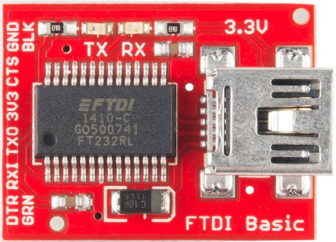

# Serial Communication

## Finding the serial COM port

<https://www.youtube.com/watch?v=hou4okcCX7E>

Open *Computer Management > System Tools > Device Manager > Ports (COM & LPT)* or *Start Menu > Control Panel < Device manager*.  
Identify the port number xx next to the text 'USB Serial Port (COMxx).

## ESP-01 serial communication

### Prepare the FTDI 

We used a [sparkfun FTDI Basic 3.3V](https://www.sparkfun.com/products/9873) but any equivalent USB to serial converter can be used.  Make sure to use a 3.3 V device to be compatible with the 3.3 V ESP 8266 device.

[Install the drivers 1](https://learn.sparkfun.com/tutorials/how-to-install-ftdi-drivers/all)

[Install the drivers 2](http://www.ftdichip.com/Drivers/VCP.htm)

### FTDI card pinout

The pin definitions are shown on the silkscreen on the left side of the PCB.

## nodeMCU LoLin CH340G serial port

Windows drivers are available [here](http://www.arduined.eu/tag/ch340g/). Download the zip file, look for the driver directory `CH341SER` and click on `setup.exe`.

Plug in your LoLin board and then the serial driver should appear similar to this in the device manager:

