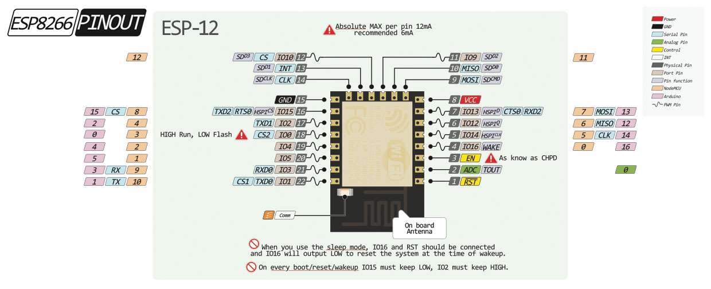
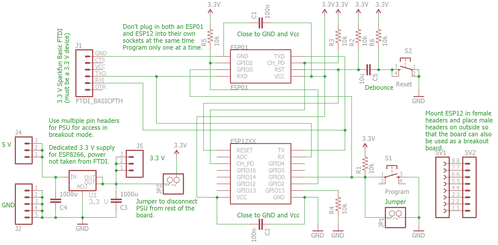

# ESP8266 Programmers and Serial Communication

## ESP8266 boot up modes
See [here](https://github.com/esp8266/esp8266-wiki/wiki/Boot-Process# esp-boot-modes) and [here](http://www.forward.com.au/pfod/ESP8266/GPIOpins/index.html).  The device can boot in different modes, selected on power-up based on GPIO pin levels.  

|GPIO15 / MTDO 	|GPIO0 	|GPIO2 	|Mode 	Description|
|--|--|--|--|
|L 	|L 	|H |Programming download via UART|
|L |H 	|H 	|Normal operation, boot from SPI Flash|
|H 	|x 	|x 	|SDIO 	Boot from SD-card|

The settings of these inputs is only checked during the power up (or reset) of the chip. After that the pins are available for general use, but  restricted by these external pull up/down resistors.

Pins are pulled up to Vcc or down to ground.  Pull-up and pull-down resistors can be in the range 2k to 10k. A 2k resistor gives better noise immunity.

https://www.hackster.io/glowascii/esp8266-programming-jig-5afd03

http://blog.thethings.io/connect-esp8266-to-the-internet-at-thethings-io

http://www.forward.com.au/pfod/ESP8266/GPIOpins/index.html

## ESP01

### ESP01 hardware

### ESP01 Example software download

From [here](https://www.hackster.io/glowascii/esp8266-programming-jig-5afd03), where he tests with a web server example:

1. Plug ESP into jig, then FTDI into jig, then FTDI into computer
1. Open the WiFiWebServer example (File > Examples > ESP8266WiFi > WiFiWebServer)
1. Set up the serial comms (115200 of whatever baud rate)
1. Hold down P (to program), press and release R (to reset)
1. Click "Upload"
1. Wait for "Done uploading" (If you get an error, see below for troubleshooting!)
1. Release P, open Serial Monitor, press R
1. Wait for WiFi connection; note the IP address that appears.
1. Open your Web browser, navigate to ipaddress/gpio/1 or .../0
1. Success???

<pre>
/*
 *  This sketch demonstrates how to set up a simple HTTP-like server.
 *  The server will set a GPIO pin depending on the request
 *    http://server_ip/gpio/0 will set the GPIO2 low,
 *    http://server_ip/gpio/1 will set the GPIO2 high
 *  server_ip is the IP address of the ESP8266 module, will be
 *  printed to Serial when the module is connected.
 */

#include <ESP8266WiFi.h>

const char* ssid = "Brainwash";
const char* password = "";

// Create an instance of the server
// specify the port to listen on as an argument
WiFiServer server(80);

void setup() {
  Serial.begin(9600);
  delay(10);

  // prepare GPIO2
  pinMode(2, OUTPUT);
  digitalWrite(2, 0);

  // Connect to WiFi network
  Serial.println();
  Serial.println();
  Serial.print("Connecting to ");
  Serial.println(ssid);

  WiFi.begin(ssid, password);

  while (WiFi.status() != WL_CONNECTED) {
    delay(500);
    Serial.print(".");
  }
  Serial.println("");
  Serial.println("WiFi connected");

  // Start the server
  server.begin();
  Serial.println("Server started");

  // Print the IP address
  Serial.println(WiFi.localIP());
}

void loop() {
  // Check if a client has connected
  WiFiClient client = server.available();
  if (!client) {
    return;
  }

  // Wait until the client sends some data
  Serial.println("new client");
  while(!client.available()){
    delay(1);
  }

  // Read the first line of the request
  String req = client.readStringUntil('\r');
  Serial.println(req);
  client.flush();

  // Match the request
  int val;
  if (req.indexOf("/gpio/0") != -1)
    val = 0;
  else if (req.indexOf("/gpio/1") != -1)
    val = 1;
  else {
    Serial.println("invalid request");
    client.stop();
    return;
  }

  // Set GPIO2 according to the request
  digitalWrite(2, val);

  client.flush();

  // Prepare the response
  String s = "HTTP/1.1 200 OK\r\nContent-Type: text/html\r\n\r\n<!DOCTYPE HTML>\r\n<html>\r\nGPIO is now ";
  s += (val)?"high":"low";
  s += "</html>\n";

  // Send the response to the client
  client.print(s);
  delay(1);
  Serial.println("Client disonnected");

  // The client will actually be disconnected
  // when the function returns and 'client' object is detroyed
}
</pre>

## ESP12
Nice overview [here](http://blog.falafel.com/how-to-wire-the-esp8266-for-programming)

The EPS12 and ESP12e pin outs are as follows:

  

Digital pins 6—11 are not shown on this diagram because they are used to connect flash memory chip on most modules. Trying to use these pins as IOs will likely cause the program to crash.

The following schematic shows an ESP01/ESP12 programming circuit.  The circuit has all the required pull-up, pull-down and decoupling capacitors as well as the programming and reset switches

## Serial link set up
### Prepare the FTDI

We used a [sparkfun FTDI Basic 3.3V](https://www.sparkfun.com/products/9873) but any equivalent USB to serial converter can be used.  Make sure to use a 3.3 V device to be compatible with the 3.3 V ESP 8266 device.

[Install the drivers 1](https://learn.sparkfun.com/tutorials/how-to-install-ftdi-drivers/all)

[Install the drivers 2](http://www.ftdichip.com/Drivers/VCP.htm)

### FTDI card pinout

The pin definitions are shown on the silkscreen on the left side of the PCB.

## nodeMCU LoLin CH340G serial port

Windows drivers are available [here](http://www.arduined.eu/tag/ch340g/). Download the zip file, look for the driver directory `CH341SER` and click on `setup.exe`.

Plug in your LoLin board and then the serial driver should appear similar to this in the device manager:

## Finding the serial COM port

<https://www.youtube.com/watch?v=hou4okcCX7E>

Open *Computer Management > System Tools > Device Manager > Ports (COM & LPT)* or *Start Menu > Control Panel < Device manager*.  
Identify the port number xx next to the text 'USB Serial Port (COMxx).

