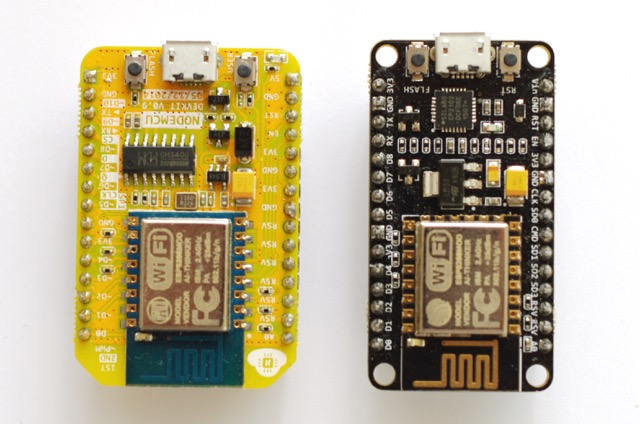

#nodeMCU V3 Lolin on the Arduino IDE

##Introduction
A brief [introduction](http://embeddedcomputing.weebly.com/nodemcu-board.html) states: "The NodeMCU board is based on an ESP8266-12 but features a built-in serial over USB interface and other amenities like 2 buttons and 2 LEDs.  The board can be programmed using the Wiring / Arduino framework as the other ESP8266 boards.  It features more available GPIOs, of which 
-  9 digital GPIOs operating at 3,3V 
- one analog GPIO, albeit limited to 1,8 V.

Hardware variants:
- The NodeMCU V0.9 (brown PCB) uses the CH340 serial to USB programmer (needs a specific driver).  
- The nodeMCU V1 (green PCB) uses the CP2102 serial programmer.  
- The nodeMCU V2 - no information.  
- The nodeMCU V3 Lolin (green PCB) uses the CH340G serial programmer.  

##Connecting the nodeMCU to the IDE
