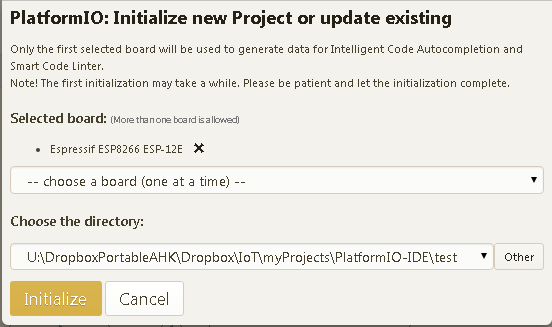
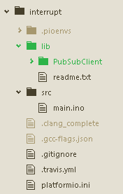

# ESP8266 on the PlatformIO with the Arduino framework

## ESP8266 Arduino IDE core libraries

The ESP8266 Arduino IDE core libraries present the same API to the user as does die Arduino libraries, but is is coded to flash ESP8266 code.  For more detail see [here](https://github.com/NelisW/myOpenHab/blob/master/docs/411-ESP8266-prepare-Arduino-IDE.md).

## PlatformIO

<http://platformio.org/# !/>  
<http://docs.platformio.org/en/latest/frameworks/arduino.html>

The next generation integrated development environment for IoT.
C/C++ Intelligent code completion and Smart code linter with Built-in Terminal and Serial Monitor.

Rapid Embedded Development, Continuous and IDE integration in a few steps with PlatformIO thanks to built-in project generator for the most popular embedded boards and IDE.

Hundreds Popular Libraries are organized into [single Web 2.0 platform](http://platformio.org/# !/lib): list by categories, keywords, authors, compatible platforms and frameworks; learn via examples; be up-to-date with the latest version.

PlatformIO is written in pure Python and doesn't depend on any additional libraries/tools from an operation system. It allows you to use PlatformIO beginning from PC and ending with credit-card sized computers

PlatformIO manual is [here](https://media.readthedocs.org/pdf/platformio/latest/platformio.pdf)

PlatformIO supports the [Arduino framework](http://docs.platformio.org/en/latest/frameworks/arduino.html), so all the Arduino libraries work out the box, as if built on the Arduino IDE.

http://charlottegodley.co.uk/writing-libraries-for-arduino/

http://www.penninkhof.com/2015/12/1610-over-the-air-esp8266-programming-using-platformio/

http://blog.squix.ch/2016/01/esp8266-arduino-ide-alternative.html

## Installing

There are several different options to install and use PlatformIO: as a commandline tool, as a package in Atom or integrated into your own favourite IDE.  See the install website:  http://platformio.org/# !/get-started

PlatformIO by itself is a Python-based library manager and project builder.  The core commandline (CLI)functionality can be installed like any other PYthon package:

        pip install platformio

There are two [Atom](https://atom.io/)-based installation options:
[PlatformIO-IDE](https://atom.io/packages/platformio-ide)
and
[Platomformio](https://atom.io/packages/platomformio).  I installed the
[PlatformIO-IDE](https://atom.io/packages/platformio-ide) which is part of the [PlatformIO offering](http://platformio.org/# !/platformio-ide). See the [documentation](http://docs.platformio.org/en/latest/ide/atom.html).

The general Atom manual is [here (PDF)](http://orm-atlas2-prod.s3.amazonaws.com/pdf/9af84cd12b0be2cc97b3951aee5bf949.pdf) and [here (online)](https://atom.io/docs/latest/).
For future reference, note that the Atom packages are installed into `~/.atom/packages`.  New packages are installed from the Atom menu `Packages/Settings View/Install packages/themes`.  You can also copy the package files manually to this directory.

Select the editor themes according to your liking. Click on `Settings/Themes` then select the UI theme and syntax theme. I like the pre-installed `One light` UI theme and the `Solarized light` syntax themes.

When you install [`platformio-ide`](https://atom.io/packages/platformio-ide), it also installs `platformio-ide-terminal` and `tool-bar`.  While you are busy installing platformio, you might just as well also install these useful Atom packages:
`autocomplete-python`,
`open-recent`,
`highlight-selected`,
`minimap`,
`language-arduino`,

Some packages are loaded by default, such as `markdown-preview`.

After PlatformIO-IDE package in Atom, it adds a new menu (PlatformIO) and a toolbar.  You can switch off the toolbar in the menu.

## Arduino and local libraries

<http://docs.platformio.org/en/latest/ide/atom.html# atom-ide-quickstart>  
<http://docs.platformio.org/en/latest/quickstart.html>  

After a fresh install the appropriate libraries must still be downloaded.  On the `PlatformIO` menu entry, select `Initialize new PlatformIO project...`.  Select the framework you want to use and then select the board you want to use.  When clicking `Initialize` it may take a while to download the files required for the framework and the board.

The new project is set up in a new directory (according to your choosing).   

The directory structure is shown above, explained as follows:

-  Project Configuration File [`platformio.ini`](http://docs.platformio.org/en/latest/projectconf.html# projectconf). This file defines the target hardware. Example entry:

        [env:esp12e]
        platform = espressif
        framework = arduino
        board = esp12e

-  `src` directory where you should place source code (`*.h, *.c, *.cpp, *.S, *.ino,` etc.).  Your project code comes here.
-  `lib` directory can be used for the project specific (private) libraries. This means that dedicated libraries can be used.  The directory and file structure details are located in `lib/readme.txt` file.  In the example directory shown above the `PubSubClient` library was downloaded as a project-specific local library (note that is is available in the platformio library set, and should rather be installed from there).
-  Miscellaneous files for CVS and Continuous Integration support.

## Installing platformio libraries

Some libraries are not in the preloaded set and must be downloaded when required.
Open `http://platformio.org/lib` and search for the required library. For example look for the DallasTemperature or BMP085 libraries.
It will open a new page with a list of all possible libraries (in the examples below only one DallasTemperature library but many BMP085 libraries are found).  Click on the name of the specific library you want to install.

This should take you to the download page.

Notice down the bottom of the page there are instructions how to download.  You can either click the download button (bottom right) and do a regular download, or do a commandline install (see the line at the bottom left).  The easiest method is to work in an environment with no proxies (and disable your PC IE proxy) and then type the following at the command line to load the DallasTemperature library (which is number 54):

    platformio lib install 54

This will install both the  DallasTemperature library and its dependency, the OneWire library.  The libraries will be installed in the general platformio library folders `%USER%\ezwill\.platformio\lib`, not in a project folder.

## Building and downloading

The code is built by clicking on the arrow icon, and the code can be downloaded to the board by clicking on the right-arrow icon.  The dustbin icon cleans the directory by removing all temporary files.

Sometimes the build fails because the `.pioenvs` directory cannot be deleted as part of the build process.  The simplest solution is to save all the files and exit and re-open Atom.

Build and download progress are displayed in a pop-up panel, called the Build Panel.  Pressing F8 toggles the appearance and removal of the Build Panel.

The `Serial.Print` output appears in the serial monitor, which can be opened from the PlatformIO menu.  Close the serial monitor before attempting the next download.

## ESP8266 over the air (OTA) updates

PlatformIO supports OTA on the Expressif platform.  It appears intimidating at first look, but actually is quite simple.
For more details see here: <https://github.com/NelisW/myOpenHab/blob/master/docs/417-ESP8266-over-the-air-OTA.md>
