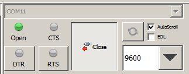
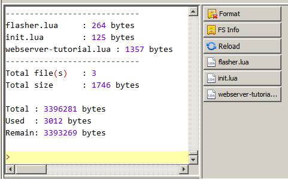

#nodeMCU with its native tools

##Introduction

The [nodeMCU](nodemcu.com/index_en.html) is the primary source of information.  nodeMCU is pre-loaded on the nodeMCU dev boards, but you can also [flash it on an ESP01](http://randomnerdtutorials.com/esp8266-web-server/).

nodeMCU's main attraction appears to be the availability of [lua on ESP8266](https://www.youtube.com/watch?v=_GSYZ1e14nc), but nodeMCU also offers a simple file system and a variety of server options and other tools.

NodeMCU is a firmware that allows you to program the ESP8266 modules with LUA script. And you’ll find it very similar to the way you program your Arduino. With just a few lines of code you can establish a WiFi connection, control the ESP8266 GPIOs, turning your ESP8266 into a web server and a lot more.

##Flashing nodeMCU to the ESP01

This article focuses mostly on using the nodeMCU dev boards, but you can flash the nodeMCU software to an ESP01 and achieve the same effect as using the dev board.  Note, however that the ESP01 has limited memory and this may limit you to smaller projects.  [Flashing noceMCU firmware on the ESP8266 using Windows](http://randomnerdtutorials.com/flashing-nodemcu-firmware-on-the-esp8266-using-windows/) provides instructions.

##Integrated Development Environments

1. [ESPlorer](http://esp8266.ru/esplorer/), the essential multiplatforms tools for any ESP8266 developer from luatool author’s, including a LUA for NodeMCU and MicroPython. Also, all AT commands are supported.  [Download binaries (big blue button)](esp8266.ru) or see [Github repo](https://github.com/4refr0nt/ESPlorer). See [here for instructions for installing on Linux](http://www.digitalsyncretism.com/blog/esplorer-tool/). The use of ESPlorer is well documented in [Getting Started With The ESPlorer IDE](http://esp8266.ru/download/esp8266-doc/Getting%20Started%20with%20the%20ESPlorer%20IDE%20-%20Rui%20Santos.pdf) and [Home Automation Using ESP8266](http://randomnerdtutorials.com/home-automation-using-esp8266/) both written by Rui Santos.

2. The [LuaLoader](http://benlo.com/esp8266/index.html#LuaLoader)  is a Windows program for uploading files to the ESP8266 and working with the Lua serial interface. See also [here](http://benlo.com/esp8266/esp8266QuickStart.html)

3. The [LoLin IDE](http://www.wemos.cc/wiki/Tutorial/IDE) provides basic but reasonably complete support for working with the board.  There appears to be a connection between the [wemos D1](http://www.wemos.cc/d1/Main_Page) and the Lolin, but the details are not clear.  
The LoLin [firmware can be upgraded](http://www.wemos.cc/wiki/Tutorial/UpgradeFirmware).

##ESPlorer with LoLin

This section serves to capture my work with ESPlorer on the LoLin board.  I purchased Rui Santos' book [Home Automation Using ESP8266](http://randomnerdtutorials.com/home-automation-using-esp8266/) and I will first start working through this book.

The LoLin can run from the computer's USB supply only, no external power supply required.  It has a 3.3 V voltage-down regulator that provides the 3.3 V for the ESP.  Presumably the nodeMCU V3 (LoLin) and the nodeMCU V1 pin definitions are the same: 

###Starting up and connecting to the nodeMCU

Follow the instructions in [Getting Started With The ESPlorer IDE](http://esp8266.ru/download/esp8266-doc/Getting%20Started%20with%20the%20ESPlorer%20IDE%20-%20Rui%20Santos.pdf):
1. Install the USB-to-serial driver for the UART chip (CH340 if a LoLin board is used!).
2. Power up and plug in the ESP device.
3. Open ESPlorer - the hardware must be running first before opening ESPlorer).
4. To connect to the nodeMCU, look at the top right of the ESPlorer window:
  -  click on the refresh button,
  -  select the com port that is allocated to your nodeMCU (see 412-ESP8266-connect-serial-board.md),
  -  set the baud rate to 9600,
  -  click on the connect button.
  

###Filenames and file management

nodeMCU has an elementary file system that allows us to download and run lua files on the ESP. Many different scripts and files can be uploaded and run when appropriate.

The file `init.lua` will be run whenever the chip boots (on startup).  Use this file to run code that sets up the wireless SSID and other identification and set up data.  

ESPlorer has a very nice 'browser' to show the files on the ESP.  Click on the `Reload` button (see below) to see all the files currently on the file system.  To run the file, click on the button with the filename on the right edge.

The bottom of the right side has drop-down menu with a number of commonly used commands, such as `dofile("")` which can be sent to the ESP by pressing on the Send button.  In this case enter the name of the file as the first parameter in the `dofile` call.  The `Reset` button can be used to reset the chip.

###Wireless setup
If the ESP is set up as [access point](https://en.wikipedia.org/wiki/Wireless_access_point) (allows other wifi devices to connect to a network) remember to set up a password to prevent unauthorised access.  In most cases the ESP will be set up as a station, meaning that it is only a client and does not connect to other networks.

My WLAN already has an access point and the ESP8266 must be set up in station mode.  Put the following commands in the init.lua file (replace with your own network SSID/name and password (WEP/WPA/etc.):

	wifi.setmode(wifi.STATION)
	wifi.sta.config("WLAN-SSID","WLAN-password")
	print(wifi.sta.status())
	print(wifi.sta.getip())
	print(wifi.sta.getmac())

See the [API](https://github.com/nodemcu/nodemcu-firmware/wiki/nodemcu_api_en) or [API](http://www.nodemcu.com/docs/wifi-sta-module/#wifi-sta-module-wifi-sta-getmac) for more detail on these functions.  The first line sets the wifi in station mode.  The second line passes the wireless router's SSID and password to the router to request access. Wait for a short while before testing the status, the wifi connection protocol takes some time. The remaining three lines prints the status, IP address and MAC address of the ESP8266 wifi station. A status of 5 means that an IP address has been granted.

###LED Flasher

Experiment with Rui's guidance from the [Getting Started With The ESPlorer IDE](http://esp8266.ru/download/esp8266-doc/Getting%20Started%20with%20the%20ESPlorer%20IDE%20-%20Rui%20Santos.pdf).  The process is well documented and there is no need for me to repeat everything here.

Note that the LED flash example requires an external LED to be connected to GPIO2. On the nodeMCU, this is pin D4. I used a 120 Ohm series resistor to limit the LED current from pin D4.

	-- code originally by Rui Santos (I think!).
	lighton=0
	-- pin 4 is GPIO 2, or D4 on the nodeMCU.
	pin=4
	gpio.mode(pin,gpio.OUTPUT)
	tmr.alarm(1,2000,1,function()
	    if lighton==0 then
	        lighton=1
	        gpio.write(pin,gpio.HIGH)
	    else
	        lighton=0
	         gpio.write(pin,gpio.LOW)
	    end
	end)

The code is reasonably self-explanatory, except perhaps the timer code.  The [API](http://www.nodemcu.com/docs/timer-module/) docs describes the `tmr.alarm` parameters as  follows:

	tmr.alarm(id, interval, repeat, function do())
	
- id: 0~6, alarmer id. 
- Interval: alarm time, unit: millisecond
- repeat: 0 - one time alarm, 1 - repeat
- function do(): callback function for alarm timed out

So it seems that this code uses timer 1, with a 2 second interval, repeating and it then executes the function embodied in the call (sometimes called a lambda function in other languages).

###ESP8266 Web Server controlling LEDs.

This is another one of  Rui Santos' great [examples](http://randomnerdtutorials.com/esp8266-web-server/) tutorials.   He shows us how to create a standalone web server with an ESP8266 that can toggle two LEDs.

##Diverse Projects

These are really links I stumbled on just want so save them for later study.

<http://www.instructables.com/id/ESP8266-Automatic-Router-Restart/?ALLSTEPS>

<https://learn.adafruit.com/adafruit-huzzah-esp8266-breakout/using-nodemcu-lua>

<https://github.com/nodemcu/nodemcu-firmware/blob/master/README.md> has some code for mqtt and many other nice examples.

<http://randomnerdtutorials.com/how-to-make-two-esp8266-talk/>

