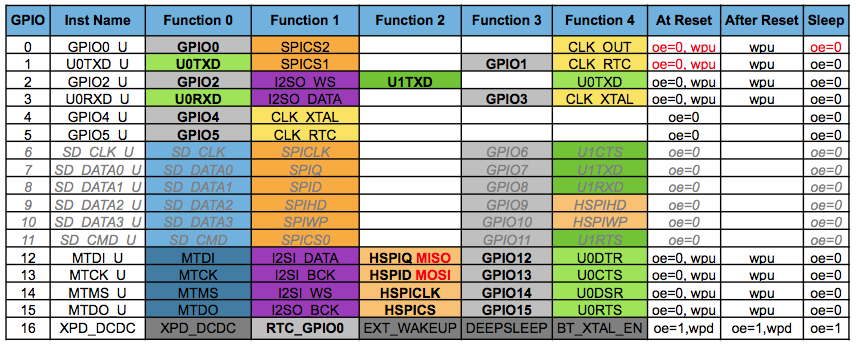

# Programming details

<https://github.com/esp8266/Arduino/blob/master/doc/reference.md>    

<http://www.devacron.com/arduino-ide-for-esp8266/>  

<https://github.com/esp8266/arduino>

## Digital IO
### Arduino Core
The definitive framework for the Arduino Core ESP8266 library is given here:
<https://github.com/esp8266/Arduino/blob/master/doc/reference.md>

Pin numbers in Arduino correspond directly to the ESP8266 GPIO pin numbers. `pinMode`, `digitalRead`, and `digitalWrite` functions work as usual, so to read GPIO2, call `digitalRead(2)`.

Digital pins 0—15 can be `INPUT`, `OUTPUT`, or `INPUT_PULLUP`. Pin 16 can be `INPUT`, `OUTPUT` or `INPUT_PULLDOWN_16`. At startup, pins are configured as `INPUT`.

Pins may also serve other functions, like Serial, I2C, SPI. These functions are normally activated by the corresponding library. The diagram below shows pin mapping for the popular ESP-12 module.

Digital pins 6—11 are not shown on this diagram because they are used to connect flash memory chip on most modules. Trying to use these pins as IOs will likely cause the program to crash.

Note that some boards and modules (ESP-12ED, NodeMCU 1.0) also break out pins 9 and 11. These may be used as IO if flash chip works in DIO mode (as opposed to QIO, which is the default one).

### Expressif SDK Pin Functions (may be different from Arduino Core)

In the Espressive SDK  The most usable pin functions are mapped to the macro SPECIAL, so calling pinMode(pin, SPECIAL) will switch that pin to UART RX/TX on pins 1 - 3, HSPI for pins 12-15 and CLK functions for pins 0, 4 and 5. SPECIAL maps to:

    0. CLK_OUT
    1. TX0
    2. TX1
    3. RX0
    4. CLK_XTAL
    5. CLK_RTC
    12. SPI_MISO
    13. SPI_MOSI
    14. SPI_CLK
    15. SPI_SS

You can activate any “FUNCTION_” with pinMode(pin, FUNCTION_1)for example
Note : func number 1-5 in Expressife table correspond to FUNCTION 0-4 in SDK

When using a GPIO as output (i.e. to drive something such as an LED) it is important to note that the maximum output current is 12mA.

## LED Pin

GPIO1 which is also TX is wired to the blue LED on many devices. Note that the LED is active low (conected to Vcc and sinks through the chip to ground) so setting a logical value of 0 will light it up. Since GPIO1 is also the TX pin, you won't be able to blink the LED and perform Serial communications at thew same time unless you switch TX/RX pins

## Interrupts and Timers

Pin interrupts are supported through `attachInterrupt`, `detachInterrupt` functions. Interrupts may be attached to any GPIO pin, except GPIO16. Standard Arduino interrupt types are supported: `CHANGE`, `RISING`, `FALLING`.

http://www.switchdoc.com/2015/10/iot-esp8266-timer-tutorial-arduino-ide/

This project describes how to obtain a steady 2 millisecond interrupt based timer to do the pulse sampling.
The best way of doing this is to use a timer and a callback routine.
Note that it doesn't have to be a repeatable event.  You can schedule one-shots too in the future.

There are two types of timers on the ESP8266.   There is os_timer, which is a software based interval timer.  The second type of timer is a hardware based timer, hw_timer, of which there is apparently only one.  We would suggest not to use the hw_timer, as we really don’t know or understand what the ESP8266 libraries are using it for.  You could easily screw up the WiFi, for example.   The documentation for the hw_timer is sparse, at best.  Our example below uses the os_timer.

The os_timers are supported from the [Expressif SDK](https://github.com/espressif/ESP8266_RTOS_SDK/blob/master/include/espressif/esp_timer.h).
Because os_timer is a software timer, based on the underlying hardware timer, it is 'Soft Real Time'.  Depending on what the rest of the operating system is doing (WiFi, PWM, etc.), it will interrupt you when triggered, but it isn’t at an exact time.  The faster interval you set for the os_timer, the more jitter you may see.
There is no clarity on how many os_timers the ESP can support --- some blogs claim that the os_timer apparently only has capacity to have seven timers set at one time.
[Other blogs](http://cholla.mmto.org/esp8266/sdk/timers.html) claim differently.
Not all the SDK source are freely available, the only implementation I could find is [alternative implementation](https://gitlab.com/Phrobs/esp8266-frankenstein/blob/master/src/esp_timer.c), but this is not the true SDK code.

Here are few pointers about using interrupts in the ESP8266, as well as in any Arduino based system.

-  Keep your Interrupt Service Routine (ISR) short.  ISR is another name for the callback function.
-  Do not use 'serial print' commands in an ISR.  The serial commands also use interrupts and using them can hang the processor
-  It is good practice to disable interrupts in an ISR routine (os_intr_lock();/os_intr_unlock();) and then enable them as you leave.   We are not doing that in this routine as we are not sure what the effects would be on the underlying operating system.  Our routine is so short, it clearly doesn’t matter here.
-  Note that the real work of the interrupt is being done in the main loop.  That can affect your timing of your servicing your interrupt.
-  You have to put a yield() or a delay(0) in your main loop to allow the underlying operating system to do it’s work.
-  There is a watchdog timer in the ESP8266 that will reset the processor if you keep it busy too long.  More on that in a future posting.   Put lots of yield() or delay(0) statement in your program to keep this from happening.  Note, delays with values greater than zero (delay(10) for example) are fine.

http://tech.scargill.net/esp8266-timers/

Here is [some advice](http://cholla.mmto.org/esp8266/sdk/timers.html) on the use of os_timers:

1.There are "sloppy" timers like these and also hardware timers.
1. You need to disarm the timer before setting it up.
1. You don't initialize or allocate a timer, you just start with an empty structure and have at it.
1. The timer structure cannot be a stack variable, it needs to persist after user_init() (or whatever) exits.
1. setting the Wifi mode to null avoids lots of useless messages.

## Analog input

ESP8266 has a single ADC channel available to users. It may be used either to read voltage at ADC pin, or to read module supply voltage (VCC).

To read external voltage applied to ADC pin, use analogRead(A0). Input voltage range is 0 — 1.0V.

To read VCC voltage, use ESP.getVcc() and ADC pin must be kept unconnected. Additionally, the following line has to be added to the sketch:

    ADC_MODE(ADC_VCC);

This line has to appear outside of any functions, for instance right after the # include lines of your sketch.

The ADC cannot be used when the chip is transmitting. Otherwise the voltage may be inaccurate (from Expressif datasheet CH 8.5).

http://arduino.stackexchange.com/questions/17903/interrupt-on-analog-port-esp8266-w-arduino

## PWM / Analog output

`analogWrite(pin, value`) enables software PWM on the given pin. PWM may be used on pins 0 to 15. Call `analogWrite(pin, 0)` to disable PWM on the pin. `value` may be in range from 0 to `PWMRANGE` (default 1023).  PWM range may be changed by calling `analogWriteRange(new_range)`.

PWM frequency is 1kHz by default. Call `analogWriteFreq(new_frequency)` to change the frequency.

0 to 255 is normal on an arduino board as its an 8bit ADC but ESP8266 is 10 bit so 1023 is full duty cycle.

## Timing and delays

`millis()` and `micros()` return the number of milliseconds and microseconds elapsed after reset, respectively.

`delay(ms)` pauses the sketch for a given number of milliseconds and allows WiFi and TCP/IP tasks to run. `delayMicroseconds(us)` pauses for a given number of microseconds.

Remember that there is a lot of code that needs to run on the chip besides the sketch when WiFi is connected. WiFi and TCP/IP libraries get a chance to handle any pending events each time the `loop()` function completes, OR when `delay` is called. If you have a loop somewhere in your sketch that takes a lot of time (>50ms) without calling `delay`, you might consider adding a call to `delay` function to keep the WiFi stack running smoothly.

There is also a `yield()` function which is equivalent to `delay(0)`. The `delayMicroseconds` function, on the other hand, does not yield to other tasks, so using it for delays more than 20 milliseconds is not recommended.

## Serial

`Serial` object works much the same way as on a regular Arduino. Apart from hardware FIFO (128 bytes for TX and RX) HardwareSerial has additional 256-byte TX and RX buffers. Both transmit and receive is interrupt-driven. Write and read functions only block the sketch execution when the respective FIFO/buffers are full/empty.

`Serial` uses UART0, which is mapped to pins GPIO1 (TX) and GPIO3 (RX). `Serial` may be remapped to GPIO15 (TX) and GPIO13 (RX) by calling `Serial.swap()` after `Serial.begin`. Calling `swap` again maps UART0 back to GPIO1 and GPIO3.

`Serial1` uses UART1, TX pin is GPIO2. UART1 can not be used to receive data because normally it's RX pin is occupied for flash chip connection. To use `Serial1`, call `Serial1.begin(baudrate)`.

If `Serial1` is not used and `Serial` is not swapped - TX for UART0 can be mapped to GPIO2 instead by calling `Serial.set_tx(2)` after `Serial.begin` or directly with `Serial.begin(baud, config, mode, 2)`.

By default the diagnostic output from WiFi libraries is disabled when you call `Serial.begin`. To enable debug output again, call `Serial.setDebugOutput(true)`. To redirect debug output to `Serial1` instead, call `Serial1.setDebugOutput(true)`.

You also need to use `Serial.setDebugOutput(true)` to enable output from `printf()` function.

Both `Serial` and `Serial1` objects support 5, 6, 7, 8 data bits, odd (O), even (E), and no (N) parity, and 1 or 2 stop bits. To set the desired mode, call `Serial.begin(baudrate, SERIAL_8N1)`, `Serial.begin(baudrate, SERIAL_6E2)`, etc.

**ESPtool only** Upload via serial port:  Select esptool as a programmer, and pick the correct serial port. You need to put ESP8266 into bootloader mode before uploading code (pull GPIO0 low and toggle power).

`Serial.print` is interrupt-driven, so it is "fire and forget" most of the time, unless the TX buffer overflows. When it does, it blocks hard until it gets a TX_EMPTY interrupt, then it puts more data into the buffer.
Long story short: don't call `Serial.print` from interrupt, or expect that long strings will lead to a halt (and a WDT reset afterwards).
There's `ets_printf` which doesn't buffer and you can use it from interrupts. It may loose some characters though.

## ESP8266 Keeps SSID in Memory

The [ESP keeps memory](http://www.esp8266.com/viewtopic.php?f=32&t=8204) of the most recently used wifi SSID credentials.  Flashing new executable code does not overwrite this.  

One way to erase this memory is by resetting the flash memory with the ESPTool

	pip install esptool
	python c:\Miniconda2\lib\site-packages\esptool.py -p COM7 erase_flash
 
Another  way is to clear the relevant part in memory (on most hardware: 0x7E000 -- around 128 bytes).  You can investigate more by doing this before and after changing your wifi settings:

	./esptool.py read_flash 0x7E000 128 wifisettings.bin

Then study the file using your favorite hex editor like xxd or whatever.

	xxd wifisettings.bin

## Program memory

The Program memory features work much the same way as on a regular Arduino; placing read only data and strings in read only memory and freeing heap for your application. The important difference is that on the ESP8266 the literal strings are not pooled. This means that the same literal string defined inside a `F("")` and/or `PSTR("")` will take up space for each instance in the code. So you will need to manage the duplicate strings yourself.

There is one additional helper macro to make it easier to pass `const PROGMEM` strings to methods that take a` __FlashStringHelper` called `FPSTR()`. The use of this will help make it easier to pool strings. Not pooling strings...

    String response1;
    response1 += F("http:");
    ...
    String response2;
    response2 += F("http:");

using `FPSTR` would become...

    const char HTTP[] PROGMEM = "http:";
    ...
    {
        String response1;
        response1 += FPSTR(HTTP);
        ...
        String response2;
        response2 += FPSTR(HTTP);
    }

## Libraries
https://github.com/esp8266/Arduino/blob/master/doc/libraries.md

### WiFi(ESP8266WiFi library)

This is mostly similar to WiFi shield library. Differences include:

 -    `WiFi.mode(m):` set mode to `WIFI_AP`, `WIFI_STA`, `WIFI_AP_STA` or `WIFI_OFF`.
 -    call `WiFi.softAP(ssid)` to set up an open network
 -    call `WiFi.softAP(ssid, password)` to set up a WPA2-PSK network (password should be at least 8 characters)
 -    `WiFi.macAddress(mac)` is for STA, `WiFi.softAPmacAddress(mac)` is for AP.
 -    `WiFi.localIP()` is for STA, `WiFi.softAPIP()` is for AP.
 -    `WiFi.printDiag(Serial)` will print out some diagnostic info
 -    `WiFiUDP` class supports sending and receiving multicast packets on STA interface.....

`WiFiServer`, `WiFiClient`, and `WiFiUDP` behave mostly the same way as with WiFi shield library. Four samples are provided for this library.

### Ticker

Library for calling functions repeatedly with a certain period. Two examples included.

It is currently not recommended to do blocking IO operations (network, serial, file) from Ticker callback functions. Instead, set a flag inside the ticker callback and check for that flag inside the loop function.

Here is library to simplificate `Ticker` usage and avoid WDT reset: [TickerScheduler](https://github.com/Toshik/TickerScheduler).

###  EEPROM

This is a bit different from standard EEPROM class. You need to call `EEPROM.begin(size)` before you start reading or writing, size being the number of bytes you want to use. Size can be anywhere between 4 and 4096 bytes.

`EEPROM.write` does not write to flash immediately, instead you must call `EEPROM.commit()` whenever you wish to save changes to flash. EEPROM.end() will also commit, and will release the RAM copy of EEPROM contents.

EEPROM library uses one sector of flash located just after the SPIFFS.

### I2C (Wire library)

The I2C Wire library currently supports master mode up to approximately 450KHz. Before using I2C, pins for SDA and SCL need to be set by calling `Wire.begin(int sda, int scl)`, i.e. `Wire.begin(0, 2)` on ESP-01, else they default to pins SDA(4, D2 on nodeMCU) and SCL(5, D1 on nodeMCU).

### SPI

SPI library supports the entire Arduino SPI API including transactions, including setting phase (CPHA). Setting the Clock polarity (CPOL) is not supported, yet (SPI_MODE2 and SPI_MODE3 not working).

### Other Arduino Core libaries

There are several more libaries, see https://github.com/esp8266/Arduino/blob/master/doc/libraries.md

##  Other libraries

Libraries that don’t rely on low-level access to AVR registers should work well. Here are a few libraries that were verified to work:

-  DHT11 – initialize DHT as follows: DHT dht(DHTPIN, DHTTYPE, 15);
-  DallasTemperature

###  OneWire (from https://www.pjrc.com/teensy/td_libs_OneWire.html)

Library was adapted to work with ESP8266 by including register definitions into OneWire.h Note that if you have OneWire library in your Arduino/libraries folder, it will be used instead of the one that comes with the Arduino IDE (this one).

### MQTT

http://mqttfx.jfx4ee.org/

http://www.penninkhof.com/2015/05/linking-the-esp8266-a-raspberry-pi-through-mqtt/

-  PubSubClient MQTT library

## Clock time

You can run clock time on the ESP, include `time.h` as follows:

    #include <time.h>

    void synchroniseLocalTime()
    {
        //get the current wall clock time from time servers
        //we are not overly concerned with the real time,
        //just do it as init values.
        if (WiFi.status() == WL_CONNECTED)
        {
            //my timezone is 2 hours ahead of GMT
            configTime(2 * 3600, 0, "pool.ntp.org", "time.nist.gov");
            while (!time(nullptr))
                {
                  delay(1000);
                }
            time_t now = time(nullptr);
            publishMQTT("alarmW/timesynchronised", ctime(&now));
        }
    }

    //around midday sync with the NTP server
    time_t now = time(nullptr);
    struct tm* p_tm = localtime(&now);
    if (p_tm->tm_hour==12 && p_tm->tm_min==0 && p_tm->tm_sec<6)
    {
        synchroniseLocalTime();
    }
