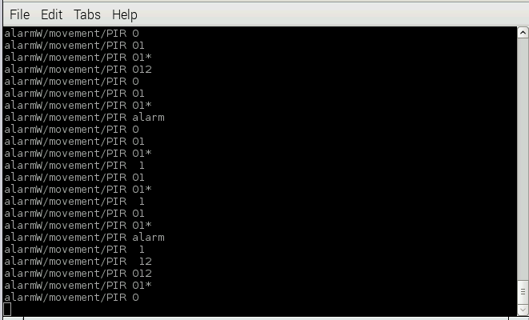
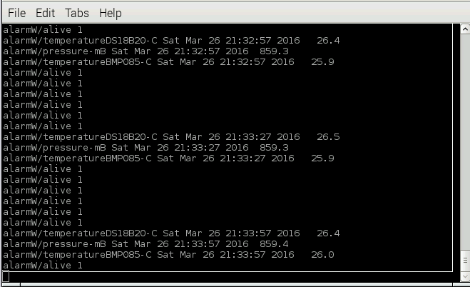
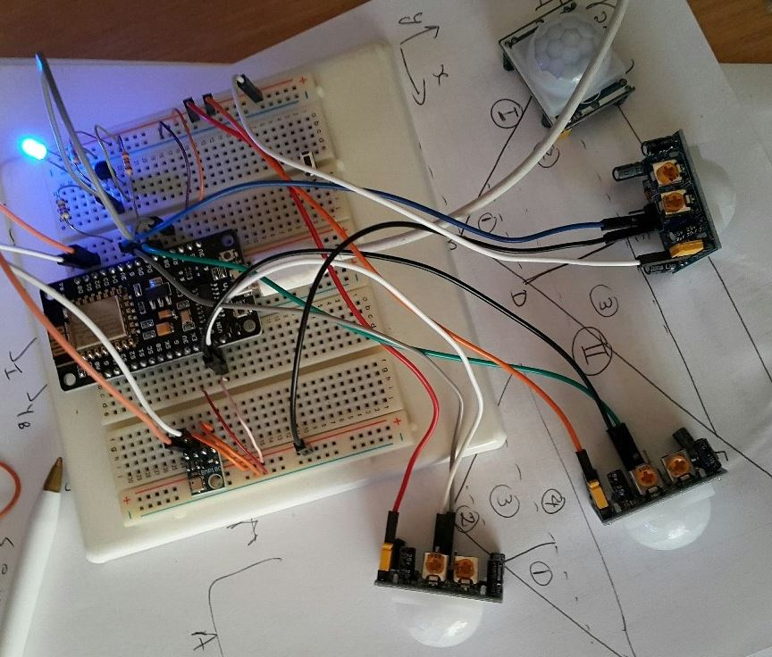
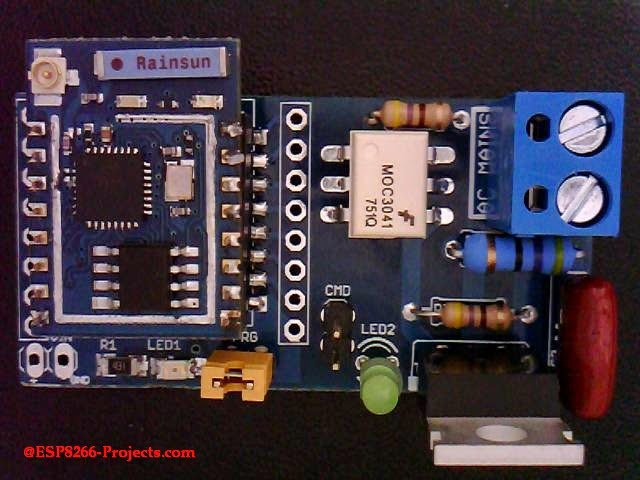
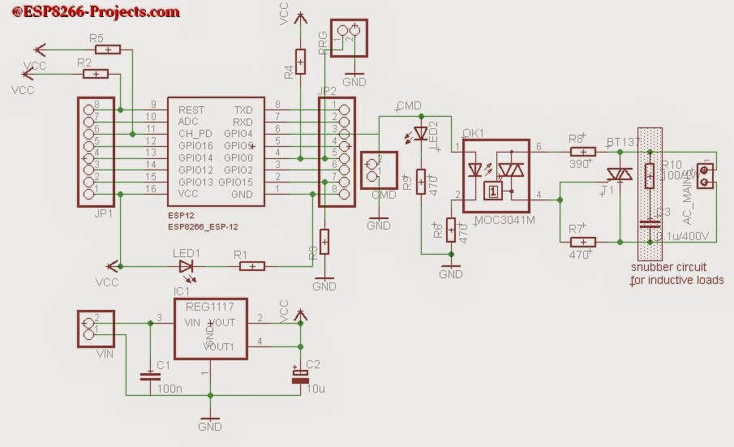
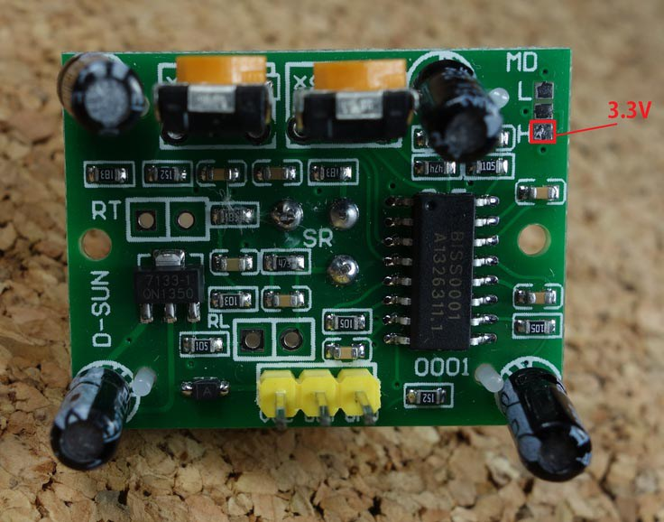
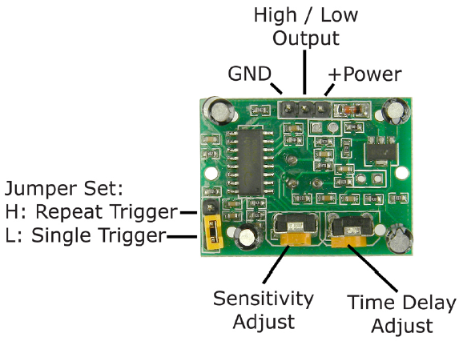

# ESP2866 PIR Alarm and more....

## Overview
### Use case
The alarm must be deployed to cover an area outside the house, such that sustained movement in Zone 1 must trigger the alarm, movement in Zone 2 must not trigger the alarm, but movement in either of the zones must switch on the light for `LEDPIRTimeOn` seconds.

Zone 1 must have a low false alarm rate: one or more designated PIR sensors must trigger while another PIR pulse is still high,
at least `numFAsamples` times in a `timFAsamples` second period. In other words at least two PIR sensor trigger pulses must be on simultaneously.  The pulse duration must be adjusted on the PIR hardware potentiometer to the required time.  The `timFAsamples` period is a running window that must keep track of `numFAsamples` alarms in the most recent `timFAsamples` seconds.  

The light must switch on for `LEDPIRTimeOn` seconds, on a trigger on any PIR, or receipt of a MQTT message from OpenHab to which the alarm is subscribed.

The first alarm implementation must give alarm if PIR0 and PIR1 trigger simultaneously, but any of PIR0, PIR1, or PIR2 must switch on a light.

The second alarm implementation must give alarm if any two PIRs trigger simultaneously, but any of PIR0, PIR1, or PIR2 must switch on a light.

If the ESP8266 alarm receives a MQTT signal to switch on the light, it must be for `LEDCtlTimeOn` seconds or until it is commanded to switch off again.

### Objective

This project creates an alarm system with the following objectives:

1. Standalone ESP8266, connected by fixed IP address on wifi to the rest of the network.
1. The ESP must be programmable/flashable over the air (OTA) once deployed.
1. The ESP must send regular MQTT pings to confirm it is alive.
1. Multiple PIR sensors, with intelligent logic before triggering the alarm.
1. Switching on a security light if any one of the PIRs is triggered.
1. The PIR-triggered light must remain on for a programmable time, and then switch off again.  
1. The light must switch on/off if an appropriate MQTT command is sent to the ESP.  
1.  The MQTT triggered light must remain on until switched off, or 3 hours, whichever occurs first.
1. Just for fun I added a DS18B20 temperature sensor.
1. And for more fun I added a BMP085 pressure sensor.
1. To timestamp the environmental data I added a local wall clock time library,  synchronised with NTP servers on the internet.  The time is synchronised at startup and then every day at noon.
1. Communicate by MQTT to subscribers to relay alarm events and environmental data to the outside world.
1. Set up the OpenHab environment to react to messages from this alarm. Outstanding.

## Software
### Source code and development environment
This text accompanies the code [available here on github](
https://github.com/NelisW/IoTPlay/blob/master/PlatformIO-IDE/interrupt/src/main.ino)

The code developed here uses the Arduino ESP8266 core framework,  in the [platformio-ide](https://github.com/NelisW/myOpenHab/blob/master/docs/413b-ESP8266-PlatformIO-Arduino-Framework.md), used from within the [atom](https://atom.io/) editor.  Using the Arduino core libraries simplifies the coding considerably compared to writing code in the Expressif SDK. This is my first major project in platformio; this tool set works very well, with minimal effort to load and maintain libraries.

### Libraries
The project uses the following libraries:

1. [PubSubClient](http://platformio.org/lib/show/89/PubSubClient) MQTT client to publish and subscribe to topics.

2. [DallasTemperature](http://platformio.org/lib/show/54/DallasTemperature) to read the DS18B20 temperature sensor.

3. [OneWire](http://platformio.org/lib/show/1/OneWire) to provide the onewire library required by the DS18B20 sensor.

4. [Sensors](http://platformio.org/lib/show/578/Sensors) to provide the I2C and BMP085 libraries required for the pressure sensor.

For more information on how to load the libraries see the platformio website or [here](https://github.com/NelisW/myOpenHab/blob/master/docs/413b-ESP8266-PlatformIO-Arduino-Framework.md).

### Controller concept

Most events don't directly control any functionality, the events rather trigger semaphores or flags in the interrupt or timer callback routines.   The interrupt service routines are very small and fast, only setting the flags, hence it returns quickly after servicing the interrupt. The control changes take place in the `loop()` function, as prescribed by the flag settings. When action is taken in the `loop()` function, the flags are reset. This approach ensures stable interrupt and timer operation. For example, the PIR trigger events are handled as follows:

The PIR interrupt pin raises the `PIRx_ISR()` interrupt callback, that sets the `PIRxOccured` flag.  The flag set in the ISR is polled in the `loop()` phase and reset to indicate that the work is complete. The work done in the `loop()` phase is to start some timers, publish a message on MQTT or to perform some other task.

In a way this design follows the principles of [distributed microservices](http://martinfowler.com/articles/microservices.html) where eash small part of the design has a clear specification and interface and prepares/processes only a small part of the total process.  The concept is well summarised [here](http://brunorocha.org/python/microservices-with-python-rabbitmq-and-nameko.html): "In brief a Micro Service Architecture exists when your system is divided in small (single context bound) responsibilities blocks, those blocks doesn't know each other, they only have a common point of communication, generally a message queue, and does know the communication protocol and interfaces."  In this project we use MQTT between the ESP-based alarm and the rest of the world, but inside this software we use flags/semaphores to signal actions between different parts of the code.  Most of the action influencing the work happens in interrupt or timer service routines, but the actual time consuming work takes place in the `loop()` phase. This approach hardens the execution of the software against time overruns or blocking interrupts.  The end result is stable software execution.

### MQTT

The main objective with this project is to raise an alarm via MQTT.  The
alarm events are escalated to an OpenHab system by another controller (the Raspberry Pi) that subscribes to the alarm MQTT messages.   The MQTT broker/server also runs on the same Raspberry Pi.

The messages are transmitted on the `alarmW/` topic and messages can be displayed on any PC on the network by the Mosquitto (or any other) client subscription command:

    mosquitto_sub -v -d -t "alarmW/+

The light can also be switched on or off via the MQTT topic `alarmW/control/LEDCtlOn`.  If the payload is `1` the light switches on, and if it has any other value it switches of.

On startup the ESP transmits a message with payload `Hello World` on topic `alarmW/alive`.

The alarm heartbeat transmits a `1`  on the topic  `alarmW/alive` at regular intervals. The subscriber can monitor this  topic and if it falls away, take some corrective action.

Motion on any of the PIR sensors results in a MQTT message on the `alarmW/movement/PIR` topic with the payload indicating which of the PIRs were triggered.  The payload can be one of three possible strings (to which the subscriber can respond as required):

1. Any PIR trigger sets of a payload of the form `012` where the `1`, `2`, or `3` indicates the number of the PIR that had a trigger condition. The number of any PIR that did not trigger is replaced with a space.  For example `0 2` means that PIR0 and PIR2 triggered, but PIR1 did not.

2. If two or more PIR sensors had a triggered state simultaneously and these PIRs are required to set off the alarm, the string is of the form `01*` which indicates that this combined trigger may set the alarm if it happens again within the prescribed time.

3. If the required number of simultaneous PIR triggers took place within the prescribed time, the alarm raises, with the payload `alarm`.  

The environmental sensors publish MQTT messages on the topics `alarmW/temperatureDS18B20-C`, `alarmW/temperatureBMP085-C`, and `alarmW/pressure-mB`, with the payload comprising the current date and time and the measured temperature or pressure in the units indicated in the topic.  It is interesting to see how the two sensors measure slightly different temperatures, generally within 0.5 C of each other during transients, but closely matched under soaked conditions.

The long strings with the date and temperature/pressure described above obviously did not work in OpenHab, because OpenHab expected only float values.  And mind you, there should also not be any leading spaces in the string either, only numbers and decimal.  To provide the required format for OpenHab, three new topics were created that works with OpenHab:  `home/alarmW/temperatureDS18B20-Cs`,  `home/alarmW/pressure-mBs`, and `home/alarmW/temperatureBMP085-Cs`.  This means three more messages, but at least we still retain the time stamped versions.

Here are two screen dumps of the MQTT messages on another computer:

### Wall clock time

The ESP has wall clock timekeeping (Arduino `time.h`) that is synchronised daily at noon with an internet NTP server. The time of day is required to support the timestamping of environmental data. Alarm events are not currently timestamped. The code describes how to program the wall clock functionality.

### Interrupts

The PIR interrupts on GPIO pins are implemented  through Arduino-style `attachInterrupt()` functions. The PIR input pins are set as interrupts of the `RISING` type.  In this code the three PIRs each has its own interrupt service routine, because we need to identify the PIRs from each other.

### Timers

A number of software times are set up to control regular events such as the alive-ping signal, the environmental sensor readings and the time periods where the light must be switched on. In total there are four timers:

 - `aliveTimer` triggering regular alive messages.
 - `LEDPIRTimer` setting the time the light must remain switched on after movement was detected.
 - `LEDCtlTimer` setting the time the light must remain on after it was switched on by a MQTT message.
 - `environmentalTickTimer` triggering regular measurement of temperature and pressure.

Also in the case of timers, are only flags set in the the timer service routines, for subsequent servicing in the `loop()` phase.

## Hardware
### Components
The idea is to use the low-cost PIR sensors available on EBay and AliExpress for dollar or two. The software is developed on the nodeMCU ESP8266 dev board.  This board is freely available on EBay and AliExpress, at a price of around USD5.  The board features a USB port, power supply regulator and download functionality.  Just plug it into the PC USB port and it works.

Presently the hardware is still in a breadboard form on my desk. A LED is switched on/off but the idea is to later use a mains-powered floodlight.

Eventually, the software will be transferred to an ESP12e-based board with integral triac to switch a mains load.  Details are available [here](http://www.esp8266-projects.com/2015/04/p2-wifi-web-power-switch-for-mains-mpsm.html).  The boards look like this:

The PIR sensors are operated from the nodeMCU 3.3V supply.  Connect the PIR ground to nodeMCU
ground. Connect the PIR positive supply to the 3.3 V supply to the H retrigger pin.

Set the jumper to single trigger to cause the PIR to create a new pulse every time new movement is detected.  The interrupt triggers on the rising edge of the PIR output. The duration of the pulse is important because at least two PIRs must trigger within this duration period.  The pulse must not be too long, because too long a pulse may prevent the detection of repeated movement because the sensor is essentially blind during this pulse. Use the 'Time delay adjust' potentiometer on the board and move it all the way to the anti-clockwise limit (shortest pulse). The shortest delay on my PIRs were around three seconds, which is about right for the simultaneous trigger requirement.

The sensitivity setting adjusts the operating range of the sensor.  More sensitive means longer range.  Play around to find the values that suits you.

### nodeMCU Pin allocation

The GPIO pin allocation is as follows:

|Define        | GPIO pin | nodeMCU pin| Used by |
|--------------|-----|----|-----------|
| DS18GPIO16D0 | 00  | D3 | DS18B20 temperature sensor|
| LEDGPIO02D4  | 02  | D4 | Light switch output|
| I2C SCL      | 04  | D2 | BMP085 pressure sensor|
| I2C SDA      | 05  | D1 | BMP085 pressure sensor|
| PIR0GPIO12D6 | 12  | D6 | PIR0 sensor|
| PIR1GPIO13D7 | 13  | D7 | PIR1 sensor|
| PIR2GPIO14D5 | 14  | D5 | PIR2 sensor|

Note that GPIO06 to GPIO11 are often used to support flash memory on some ESP boards.

GPIO01 and GPIO03 used for downloading on some ESP boards.

GPIO16 can be used to read or write, but does not support interrupts.

It turns out that only two pins are not used: GPIO15 and GPIO16.  In my dev environment GPIO15 did not work on the onewire DS18B20, so it may well be used for some purpose on the board.

## Wireless

### Fixed IP address
I have this thing about fixed IP addresses. In all my projects there may be more than
one ESP8266 device on the network and in order to do over the air (OTA) updates there
two choices: use a fixed IP address or use mDNS to resolve IP addresses.  The
fixed-IP-address seems simpler because all the configuration information is in one
file (the main.ino) file. See [here](https://github.com/NelisW/myOpenHab/blob/master/docs/417-ESP8266-over-the-air-OTA.md) how to implement fixed IP addresses.

### Over the Air Update (OTA)

OTA is faster than using the serial download and supports firmware deployment to
ESP boards irrespective of where they are, provided that network access is available
(which is a given, because the ESP8266 must be on the wifi network to do its thing).
See [here](https://github.com/NelisW/myOpenHab/blob/master/docs/417-ESP8266-over-the-air-OTA.md) how to implement OTA.

## Environmental sensors
The software uses a repeating timer and flags to read the environmental values and transmit on MQTT at regular intervals.  Both sensors are sampled during the same timer event.

Install the required libraries using the platformio command line method. The easiest method is to work in an environment with no proxies (and set your PC to no proxy) and then type the following at the command line:

    platformio lib install XX

where XX is the library number in the platformio library of libraries. The libraries will be installed in the general platformio library folder (`%USER%\.platformio\lib`), not in your project folder.  You may find it illuminating to work through the libraries downloaded here to see what happens behind the scenes. The library authors put in a huge effort to make life easier for us on the Arduino framework level.

### DS18B20 Temperature sensor

Install the `DallasTemperature` library (number 54) from <http://platformio.org/lib/show/54/DallasTemperature>.  
This will install both the  `DallasTemperature` library and its dependency, the `OneWire` library.  

Some users have difficulty getting the DS18B20 to work on the ESP8266.  A common complaint is that the temperatures are out of range at 85C, 100C, 127C or -127C.  Digging in to `DallasTemperature.h` revealed this:

    #define DEVICE_DISCONNECTED_C -127
    #define DEVICE_DISCONNECTED_F -196.6
    #define DEVICE_DISCONNECTED_RAW -7040

Also looking into the DS18B20 datasheet is is clear that 85C is the preloaded temperatures in the sensor, prior to any measurement execution.  So if you do read these values do some hardware fault finding.  I could not get the library going on GPIO pin 15 (D8 on my nodemcu), so I moved it to another pin and it worked well.

Note that the DS18B20 conversion time varies with the required resolution. The default resolution in the `DallasTemperature` library is nine bits, requiring just a little less than 100 ms.

| Mode|	Resolution|	Conversion time|
|---|---|----|
| 9 bits|	0.5°C	|93.75 ms|
| 10 bits|	0.25°C|	187.5 ms|
| 11 bits|	0.125°C|	375 ms|
| 12 bits|	0.0625°C|	750 ms|

### BMP085 pressure/temperature sensor

Install the `Sensors` library (number 578) from http://platformio.org/lib/show/578/Sensors>.  

Digging in the library source code revealed the two I2C pins used by the library. SDA defaults to GPIO04 (D2 on the nodeMCU) and SCL defaults to GPIO05 (D1 on the nodeMCU).  The values can be set with the function `Wire.begin(int sda, int scl)`.

## Integrating with openHAB
