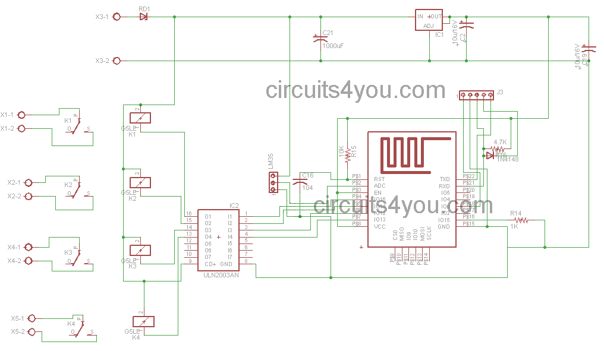

# Web servers

## IoT with 4 Relays Example Project

http://circuits4you.com/2016/05/19/iot-based-home-automation-project/

main.c

		/*
		 * Copyright (c) 2015, circuits4you.com
		 * All rights reserved.
		/* Create a WiFi access point and provide a web server on it. */

		#include <ESP8266WiFi.h>
		#include <WiFiClient.h>
		#include <ESP8266WebServer.h>

		#include "mainPage.h"

		const int Load1=16;
		const int Load2=14;
		const int Load3=12;
		const int Load4=13;

		/* Set these to your desired credentials. */
		const char *ssid = "HomeServer";
		const char *password = "homeautomation";

		ESP8266WebServer server(80);
		String L1Status,L2Status,L3Status,L4Status,Temperature;
		//=======================================================================
		//                    handles main page 192.168.4.1
		//=======================================================================
		/* Just a little test message.  Go to http://192.168.4.1 in a web browser
		 * connected to this access point to see it.
		 */
		void handleRoot() {
		  String s = MAIN_page;    
		  s.replace("@@L1@@", L1Status);
		  s.replace("@@L2@@", L2Status);
		  s.replace("@@L3@@", L3Status);
		  s.replace("@@L4@@", L4Status);
		  s.replace("@@TEMP@@", Temperature);
		  server.send(200, "text/html", s);    
		}

		//=======================================================================
		//                    Handle Set Date/Time Settings
		//=======================================================================
		void handleForm() {
		  String t_state = server.arg("submit");

		  Temperature = String(analogRead(A0)/10);   //Do calibration here

		//Change Load-1 State as per request
		  if(t_state=="ON1")
		  {
		    L1Status="ON";    
		    digitalWrite(Load1, HIGH);       //Load1 Turned on
		  }

		  if(t_state=="OFF1")
		  {
		    L1Status="OFF";    
		    digitalWrite(Load1, HIGH);      //Load1 Turned off  
		  }
		//Change Load-2 State as per request
		  if(t_state=="ON2")
		  {
		    L2Status="ON";    
		    digitalWrite(Load2, HIGH);       //Load1 Turned on
		  }

		  if(t_state=="OFF2")
		  {
		    L2Status="OFF";    
		    digitalWrite(Load2, HIGH);      //Load1 Turned off  
		  }
		//Change Load-3 State as per request
		  if(t_state=="ON3")
		  {
		    L3Status="ON";    
		    digitalWrite(Load3, HIGH);       //Load1 Turned on
		  }

		  if(t_state=="OFF3")
		  {
		    L3Status="OFF";    
		    digitalWrite(Load3, HIGH);      //Load1 Turned off  
		  }
		//Change Load-4 State as per request
		  if(t_state=="ON4")
		  {
		    L4Status="ON";    
		    digitalWrite(Load4, HIGH);       //Load1 Turned on
		  }

		  if(t_state=="OFF4")
		  {
		    L4Status="OFF";    
		    digitalWrite(Load4, HIGH);      //Load1 Turned off  
		  }

		  server.sendHeader("Location", "/");
		  server.send(302, "text/plain", "Updated-- Press Back Button");  //This Line Keeps It on Same Page

		  delay(500);
		}
		//=======================================================================
		//                    Power on setup
		//=======================================================================

		void setup() {
		  delay(1000);
		  /* You can remove the password parameter if you want the AP to be open. */
		  WiFi.softAP(ssid, password);

		  IPAddress myIP = WiFi.softAPIP();
		  server.on("/", handleRoot);
		  server.on("/form", handleForm);

		  server.begin();
		  pinMode(Load1, OUTPUT);
		  pinMode(Load2, OUTPUT);
		  pinMode(Load3, OUTPUT);
		  pinMode(Load4, OUTPUT);  
		}

		//=======================================================================
		//                    Main Program Loop
		//=======================================================================
		void loop() {
		  server.handleClient();
		}
		//=======================================================================

main.h

			const char MAIN_page[] PROGMEM = R"=====(
			<HTML>
			<TITLE>
			REMOTE LED ON/OFF CONTROL
			</TITLE>
			<BODY>
			

			<FORM>
			<TABLE>
			<TR><TD colspan=2><B>IoT Based Home Automation System</B></TD></TR>
			<TR><TD>Temp: @@TEMP@@ C</TD><TD>Load Status</TD></TR>

			<TR><TD>
			<INPUT TYPE=SUBMIT VALUE="ON1">
			<INPUT TYPE=SUBMIT VALUE="OFF1">
			</TD>
			<TD>@@L1@@</TD></TR>

			<TR><TD>
			<INPUT TYPE=SUBMIT VALUE="ON2">
			<INPUT TYPE=SUBMIT VALUE="OFF2">
			</TD>
			<TD>@@L2@@</TD></TR>

			<TR><TD>
			<INPUT TYPE=SUBMIT VALUE="ON3">
			<INPUT TYPE=SUBMIT VALUE="OFF3">
			</TD>
			<TD>@@L3@@</TD></TR>

			<TR><TD>
			<INPUT TYPE=SUBMIT VALUE="ON4">
			<INPUT TYPE=SUBMIT VALUE="OFF4">
			</TD>
			<TD>@@L4@@</TD></TR>

			<TR><TD colspan=2><B>
blog.circuits4you.com
</B></TD></TR>
			</TABLE>
			</FORM>

			

			</BODY>
			</HTML>
			)=====";

