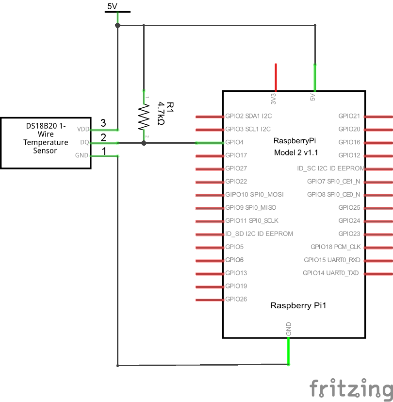

#PIR Sensors

<https://www.modmypi.com/blog/raspberry-pi-gpio-sensing-motion-detection>

[Principles of operation](http://www.glolab.com/pirparts/infrared.html)

<http://www.instructables.com/id/PIR-Motion-Sensor-Tutorial/?ALLSTEPS>

[Very brief intro with Arduino](http://bildr.org/2011/06/pir_arduino/)

[Sparkfun product](https://www.sparkfun.com/products/13285)

[Detailed overview and tutorial](https://learn.adafruit.com/pir-passive-infrared-proximity-motion-sensor/)

[Example projects](https://learn.adafruit.com/pir-passive-infrared-proximity-motion-sensor/example-projects)

[modifying-cheap-pir-motion-sensor-to-work-at-3-3v](http://randomnerdtutorials.com/modifying-cheap-pir-motion-sensor-to-work-at-3-3v/)

[arduino-with-pir-motion-sensor](http://randomnerdtutorials.com/arduino-with-pir-motion-sensor/)

http://www.raspberrypi-spy.co.uk/2013/01/cheap-pir-sensors-and-the-raspberry-pi-part-1/

http://www.raspberrypi-spy.co.uk/2013/02/cheap-pir-sensors-and-the-raspberry-pi-part-2/

http://www.millamilla.com/?p=18

https://www.modmypi.com/blog/raspberry-pi-gpio-sensing-motion-detection

https://dataissexy.wordpress.com/2013/06/29/raspberry-pi-pir-motion-detection-and-alerting-to-sms-raspberrypi-sms-sensors/

http://www.instructables.com/id/Raspberry-Pi-Motion-Sensitive-Camera/

http://www.esp8266-projects.com/2015/03/esp8266-pir-motion-sensor-detection.html?m=1

https://learn.adafruit.com/pir-passive-infrared-proximity-motion-sensor/overview

http://blog.roman-mueller.ch/index.php/2013/01/26/hc-sr501-passive-infrared-sensor-with-arduino/

http://electronics.stackexchange.com/questions/120611/help-understanding-pir-amplifier-analog-circuit