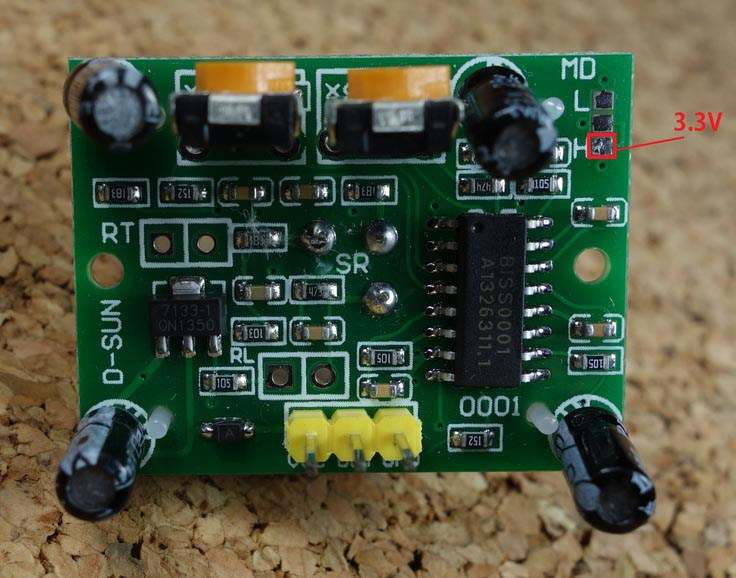
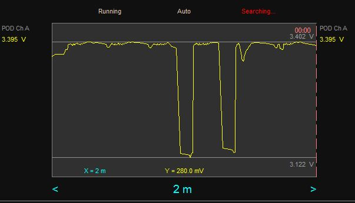
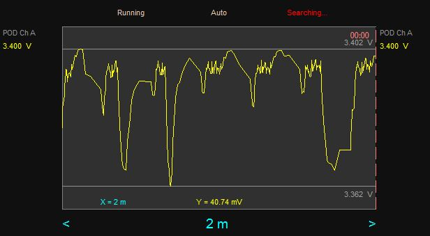

# PIR Sensors

## Overview

<http://www.teknoid.com.au/reviews/pyroelectric-infrared-sensor/>

From:   
<https://www.mpja.com/download/31227sc.pdf>    
<http://www.st.com/web/en/resource/technical/document/application_note/DM00096551.pdf>

There are several different variations of the PIR module.  The version described here is commonly available on EBay or AliExpress.

The Pyroelectric sensor responds to variations in incident infrared flux. Static scenes do not produce signals, only changes in the scene creates and output signal.  The two adjacent detector elements produces a difference signal as the image of the hot or cold objects sweeps across the detector elements.  The plastic lens is in fact a multi-faceted collection of lenses, each small lens focus flux from a different direction - thereby providing directional sensitivity.

The device operates from a 5V supply, but provides a 3.3 V output signal when movement is detected, and hence can be input to 3.3V processors. Some devices require a pull-up resistor - use 10 kOhm resistor if necessary. Electrical connection is very simple, with the supply voltage on the two outer pins and the output on the centre pin.  This output can be input to an Arduino, a Raspberry Pi or similar device.

The devices with hemispherical dome lenses have angular coverage is 110 degrees in all directions.  Detection range depends on the temperature contrast and can be up to six to eight metres for humans.

The most likely components are
1.  BIS0001  decoder chip
1.  RE200B  PIR sensing element
1.  NL11NH  multi-facet fresnel lens

Some PIR devices have visible light detectors to prevent triggering during day time.

On bootup the board may give up to three alarm triggers before settling in standby mode after 30 or so seconds, ready for operation.

In the above diagram the jumper on the left side sets the operation to (1) retrigger (H connected) to retrigger the output on every detection event or (2) single trigger (L connected) where new detections during the triggered state are ignored and only the first trigger has effect.

The two potentiometers provide the facility to adjust the sensitivity of the device (essentially a gain setting) and the output pulse width.  The pot on the left adjusts the sensitivity: counter-clockwise is less sensitive.  The pot on the right adjusts the output pulse width.

The PIR module is supplied with 5 V, but internally works at 3.3 V.
You can use the existing 5V pin or bypass or remove the regulator to work at 3.3 volt. See [here](http://iot-playground.com/blog/2-uncategorised/74-esp8266-wifi-pir-motion-sensor-easyiot-cloud-rest-api) for details.
A simpler option is to connect the 3.3 V supply to one of the retrigger pins as explained [here](http://randomnerdtutorials.com/modifying-cheap-pir-motion-sensor-to-work-at-3-3v/) and [here](http://techgurka.blogspot.co.za/2013/05/cheap-pyroelectric-infrared-pir-motion.html?m=1).  The solution is to simply connect the 3.3 V supply to the H retrigger pin.

**Sensitivity to supply voltages**

Note that the PIR sensor may be sensitive to supply voltage spikes if powered directly on the 3.3 V pin.  If I run my [PIR alarm](https://github.com/NelisW/myOpenHab/blob/master/docs/421-ESP-PIR-alarm.md) from a Samsung mobile phone charger the PIR alarms would regularly send a false alarm trigger. In this experiment the PIR sensors were within 200 mm of the ESP chip, so it could be that the close proximity also had some effect.

When measured the positive supply voltage showed the following 280 mV spikes on the nodeMCU board, after it has been down regulated to 3.3 volt:

It is not easy to filter the supply voltage on the 5V side of the regulator because the power is fed in on a USB connector and the 5V line is not easily accessible.  The two 3.3 V rails on the breadboard were both decoupled with a 150 nF and 100 uF capacitors (which is not the ideal location, you want to do this on the 5V supply before the regulator).  This dropped the spikes to around 40 mV, still causing the occasional false alarm - too many false alarms in fact.

When the decoupled circuit is powered from my laptop, the spikes are of the order of 14 mV, and then the alarm is quite quiet.

Study the PIR schematic diagram and you will note two high capacity filtering capacitors: one at the output of the regulator and another near the detector.   The capacitor near the detector is in fact in a low-pass filter configuration with the voltage divider.  This should tell us that the device is sensitive to supply voltage noise.

The nature of the spikes are quite interesting.  The same pattern appears on both the Samsung supply and the laptop supply.  We can therefore conclude that it is caused by the nodeMCU board.  The deep spikes occurs every 20 seconds or so. Perhaps there is some process taking place at this interval that sinks a significant current in the ESP8266?

Ideally one should power the PIRs from an independent regulator from the one used in the nodeCMU or to drive the ESP chip.

## Projects

### esp8266 + PIR + C (Arduino IDE)

My own PIR alarm with lots of bells and whistles: <https://github.com/NelisW/myOpenHab/blob/master/docs/421-ESP-PIR-alarm.md>

http://iot-playground.com/blog/2-uncategorised/42-esp8266-wifi-pir-motion-sensor-arduino-ide

code is here:
https://github.com/iot-playground/Arduino/blob/master/ESP8266ArduinoIDE/ESP8266_di/ESP8266_di.ino

http://iot-playground.com/blog/2-uncategorised/74-esp8266-wifi-pir-motion-sensor-easyiot-cloud-rest-api

### esp8266 + PIR + Lua

http://www.esp8266-projects.com/2015/03/esp8266-pir-motion-sensor-detection.html (unfortunately lua code)

In PIR module description you can find that it's powered at 5V!  And as you know already ESP8266 it's a 3V only chip. The good thing is that if you look in the BISS0001 datasheet you will see that it's working ok also at 3V level. Looking deeper on the PIR Module board we can find even better news: The board it's actually already a 3V one! The 5V voltage from the power pin is going only to the onboard power regulator! Output is at 3V logic levels. No level shifting or anything else needed !

## Wider reading
<https://www.modmypi.com/blog/raspberry-pi-gpio-sensing-motion-detection>

[Principles of operation](http://www.glolab.com/pirparts/infrared.html)

<http://www.instructables.com/id/PIR-Motion-Sensor-Tutorial/?ALLSTEPS>

[Very brief intro with Arduino](http://bildr.org/2011/06/pir_arduino/)

[Sparkfun product](https://www.sparkfun.com/products/13285)

[Detailed overview and tutorial](https://learn.adafruit.com/pir-passive-infrared-proximity-motion-sensor/)

[Example projects](https://learn.adafruit.com/pir-passive-infrared-proximity-motion-sensor/example-projects)

[modifying-cheap-pir-motion-sensor-to-work-at-3-3v](http://randomnerdtutorials.com/modifying-cheap-pir-motion-sensor-to-work-at-3-3v/)

[arduino-with-pir-motion-sensor](http://randomnerdtutorials.com/arduino-with-pir-motion-sensor/)

http://www.raspberrypi-spy.co.uk/2013/01/cheap-pir-sensors-and-the-raspberry-pi-part-1/

http://www.raspberrypi-spy.co.uk/2013/02/cheap-pir-sensors-and-the-raspberry-pi-part-2/

http://www.millamilla.com/?p=18

https://www.modmypi.com/blog/raspberry-pi-gpio-sensing-motion-detection

https://dataissexy.wordpress.com/2013/06/29/raspberry-pi-pir-motion-detection-and-alerting-to-sms-raspberrypi-sms-sensors/

http://www.instructables.com/id/Raspberry-Pi-Motion-Sensitive-Camera/

http://www.esp8266-projects.com/2015/03/esp8266-pir-motion-sensor-detection.html?m=1

https://learn.adafruit.com/pir-passive-infrared-proximity-motion-sensor/

https://learn.adafruit.com/pir-passive-infrared-proximity-motion-sensor/overview

https://learn.adafruit.com/pir-passive-infrared-proximity-motion-sensor/using-a-pir

http://blog.roman-mueller.ch/index.php/2013/01/26/hc-sr501-passive-infrared-sensor-with-arduino/

http://electronics.stackexchange.com/questions/120611/help-understanding-pir-amplifier-analog-circuit

This sketch will detect if the PIR motion sensor switches on, and when it is off long enough to be sure that there is no motion detected anymore.  http://playground.arduino.cc/Code/PIRsense

Python code with multiple sensors:  
<http://tigermountainsprings.net/wp/index.php/6-pir-infrared-sensors-and-the-coop/>

    # !/usr/bin/python
    #
    -*- coding: utf-8 -*-
    from multiprocessing  import Process
    import RPi.GPIO as GPIO
    import httplib2
    import time
    import pifacecommon.mcp23s17 as p
    """This program reads PIR sensors and turns on or off a relay or relays depending on the values in the table.
    NOTE!!! The relays this set controls are inverse logic.
    i.e. an inactive output (high) on piface turns the relay on
    and an active low turns it off. This is all dependant on the
    relay board common negative being pulled low by an active
    piface output on the relay board common negative.
    thus on boot the relays are not activated. Until a low is presented
    to the relay board common. Then any relay that does not have an active
    piface output (low) is turned on so the board needs to be activated by
    setting the common negative and both relay controls low at the same time.
    print("Setting Up")
    mcp.gpioa.value = mcp.gpioa.value | 28
    print("Activated GPIO binary 4,8 & 16")
    """

    def pirthread(id,pir,no,andval,orval,):
        pir_id = id
        pir_no = int(no)
        pir_high = int(andval) & 0xff
        pir_low = int(orval) & 0xff
        lighton = pir + '_Light_On'
        lightoff = pir + '_Light_Off'
        debounce = False
        while True:
            try:
                h = httplib2.Http()
                if not(debounce):
                    print (pir_id + ' waiting for input ' + str(pir_no) + ' at ' + str(time.strftime('%H:%M:%S')))
                    # print(str(pir_no) + " is " + str(GPIO.input(pir_no)))
                    debounce = False
                    GPIO.wait_for_edge(pir_no, GPIO.RISING)
                    time.sleep(.2)
                    if GPIO.input(pir_no):
                        print (pir_id + ' setting output ' + str(pir_no) + ' high')
                    mcp.gpioa.value  = mcp.gpioa.value & pir_high
                    (resp, content) = \
                        h.request("http://192.168.0.159/wd-db.php?sqlcmd=UPDATE%20WD_Master%20SET%20Char_Value%20=%20′"
                        + id
                        + "%20Active',Last_Active%20=%20NOW()%20,Active%20=%20'1'%20WHERE%20Equipment=%20'Coop_RPI'%20and%20System%20%20=%20′"
                        + pir_id + "'", 'GET')
                    (resp, content) = \
                        h.request("http://192.168.0.159/wd-db.php?sqlcmd=UPDATE%20WD_Master%20SET%20Char_Value%20=%20′"
                        + lighton
                        + "',Last_Active%20=%20NOW()%20,LastCheck%20=%20NOW()%20WHERE%20Equipment=%20'Coop_RPI'%20and%20System%20%20=%20'Coop_Outside_Lights'" , 'GET')
                        (resp, content) = \
                        h.request("http://192.168.0.159/wd-db.php?sqlcmd=INSERT%20INTO%20`pir_alarms`(`pir`,%20`alarm`)%20VALUES%20('"
                        + lighton
                        + "',%20NOW, 'GET')
                    print (lighton)
                    # with open("/var/log/pir_log", "a") as f:
                    # f.write( str(time.strftime("%m-%d %H:%M:%S")) + " – " + pir_id + chr(13) + chr(10))
                    time.sleep(300)
                    (resp, content) = \
                        h.request("http://192.168.0.159/wd-db.php?sqlcmd=UPDATE%20WD_Master%20SET%20Char_Value%20=%20′"
                        + id
                        + "%20Clear',Last_Inactive%20=%20NOW()%20,Active%20=%20'0'%20WHERE%20Equipment=%20'Coop_RPI'%20and%20System%20%20=%20′"
                        + pir_id   
                        + "'"  
                        , 'GET')
                    (resp, content) = \
                    h.request('http://192.168.0.159/getlight.php', 'GET')
                    print (content.decode())
                    if (content.decode() == lighton):
                        print ("Match")
                        print (pir_id + ' setting output ' + str(pir_no) + ' low')
                        mcp.gpioa.value = mcp.gpioa.value | pir_low
                        (resp, content) = \
                            h.request("http://192.168.0.159/wd-db.php?sqlcmd=UPDATE%20WD_Master%20SET%20Char_Value%20=%20′"
                            + lightoff
                            +"',Last_Inactive%20=%20NOW()%20,LastCheck%20=%20NOW()%20WHERE%20Equipment=%20'Coop_RPI'%20and%20System%20%20=%20'Coop_Outside_Lights'")
                    else:
                        print (content.decode() + "<>" + lighton)
                else:
                    debounce = True
                    GPIO.remove_event_detect(pir_no)
            except (KeyboardInterrupt, SystemExit):
                print ('EndingProcess " + pir_id)
                GPIO.cleanup()
                break

    mcp = p.MCP23S17()
    h = httplib2.Http()
    print ("Setting Up")
    mcp.gpioa.value = mcp.gpioa.value | 124
    print ("Activated GPIO binary 4,8 & 16")
    process_list = []
    (resp, content) = h.request("http://192.168.0.159/pir-threads.php","GET")
    process_values = content.decode().split("|")
    for myvars in process_values:
        if  myvars > '':
            tmpvars = myvars.split(',')
            GPIO.setmode(GPIO.BCM)
            GPIO.setup(int(tmpvars[2].strip()), GPIO.IN,
            pull_up_down=GPIO.PUD_DOWN)
            p = Process(target=pirthread, args=(tmpvars[0].strip(),
            tmpvars[1].split()[0].strip(),
            tmpvars[2].strip(),
            tmpvars[3].strip(),
            tmpvars[4].strip()))
            process_list.append(p)
            # print(tmpvars[0].strip())
            # print(tmpvars[1].split()[0].strip())
            # print(tmpvars[2].strip())
    try:
        for Process in process_list:
            Process.start()
        for Process in process_list:
            Process.join()
    except (KeyboardInterrupt, SystemExit):
        mcp.gpioa.value = mcp.gpioa.value & 227
        GPIO.cleanup()
        print ('All Done with the PIR')

Arduino example

http://www.mysensors.org/build/motion  
https://github.com/mysensors/
