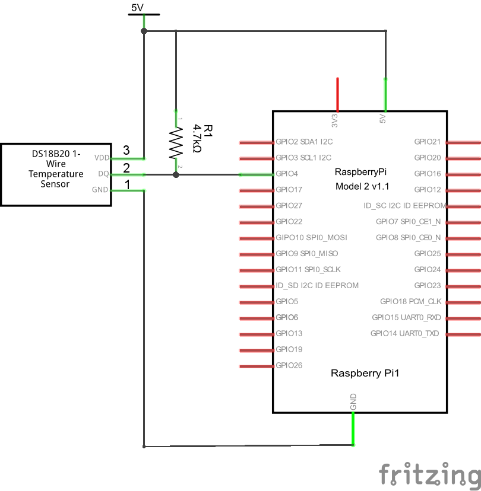

# DS18B20 temperature sensor on 1-wire

<http://datasheets.maximintegrated.com/en/ds/DS18S20.pdf>  
<http://devicehive.com/samples/python-and-raspberry-pi-temperature-sensor>  
<https://learn.adafruit.com/adafruits-raspberry-pi-lesson-11-ds18b20-temperature-sensing>  
<http://www.brainworks.it/rpi-environmental-monitoring/index.php?id=read-temperature-from-ds18b20>  
<https://www.modmypi.com/blog/ds18b20-one-wire-digital-temperature-sensor-and-the-raspberry-pi>
<http://www.astounding.org.uk/ian/raspi-1wire/>

## DS18B20 not working

Some users have difficulty getting the DS18B20 to work on the ESP8266.  A common complaint is that the temperatures are out of range at 85C, 100 C, 127C or -127C.  Digging in to Arduino Core  `DallasTemperature.h` revealed this:

    #define DEVICE_DISCONNECTED_C -127
    #define DEVICE_DISCONNECTED_F -196.6
    #define DEVICE_DISCONNECTED_RAW -7040

Also looking into the DS18B20 datasheet is is clear that 85C is the preloaded temperatures in the sensor, prior to any measurement execution.  So if you do read these values do some hardware fault finding.  

Check the power supply, perhaps don't use a parasitic supply. If you have long leads, place capacitors across the DS18B20 device power pins to keep some local charge in supply.
Keep the leads to multiple devices in a ring topology rather than a star topology.

I could not get the library going on my ESP12e GPIO pin 15 (D8 on my nodemcu), so I moved it to GPIO pin 3 (D9 on nodeMCU) and it worked well.

## Raspberry Pi

Install the 1-Wire gpio and therm drivers as described here   
<https://github.com/NelisW/myOpenHab/blob/master/docs/021-1wire-RPi.md>  

Once the drivers are installed and the devices are wired as shown [here](https://learn.adafruit.com/adafruits-raspberry-pi-lesson-11-ds18b20-temperature-sensing).  The following diagram is taken from  [here](http://devicehive.com/samples/python-and-raspberry-pi-temperature-sensor)

You can add as many DS18B20 sensors as you wish, all in parallel (use a single 4.7 kOhm resistor).  The results from each of these sensors are written in a series of directories `/sys/bus/w1/devices/28*` (starting with 28 and ending with the device ID). The temperature values are written to the file `/sys/bus/w1/devices/28__ADDRESS__/w1_slave`. To see the results open a terminal and type  

    cat /sys/bus/w1/devices/28__ADDRESS__/w1_slave

For the device currently wired in to my RPi I typed

    cat /sys/bus/w1/devices/28-000004d0250c/w1_slave

to get

    74 01 4b 46 7f ff 0c 10 55 : crc=55 YES
    74 01 4b 46 7f ff 0c 10 55 t=23250

The first line confirms that the cyclic redundancy check passed (data is trustworthy).  If the `YES` does not appear, it means that the data is not right or the device is broken.  The second line shows the temperature in degrees millicelsius after the `t=`. The value `23250` means a temperature of 23.25 deg C.

<http://datasheets.maximintegrated.com/en/ds/DS18B20.pdf>  

By default the device measures with 12 bits resolution, or 0.0625 deg C per least significant bit.
The hex values shown are the values returned from the device itself.  The first byte `74` is the least significant byte and the second byte `01` is the most significant byte. Convert the number to decimal and multiply with 0.0625 to get the temperature.  `0174` is 372, 372*0.062.5=23.25.

## Python example

This program reads all DS18B20 devices on the bus and prints the temperatures to the screen, as well as publishes the temperatures on MQTT.

    # !/usr/bin/env python
    # -*- coding: utf8 -*-

    import os
    import glob
    import time
    import datetime
    import collections

    """
    Setting up  is described in
    https://github.com/NelisW/myOpenHab/blob/master/docs/021-1wire-RPi.md  
    https://github.com/NelisW/myOpenHab/blob/master/docs/050-DS18B20-temperature.md  

    the driver expects the 1-wire device on GPIO4
    """

    # load the 1-wire interface driver, unless already loaded during boot
    # ideally it must be done at boot, commented out here
    # os.system('modprobe w1-gpio')
    # adds temperature support
    # os.system('modprobe w1-therm')

    # set up the path to device and get list of all devices
    base_dir = '/sys/bus/w1/devices/'
    device_folders = glob.glob(base_dir + '28*')

    # print(device_folders)

    def read_temp_raw(device):
        f = open(device + '/w1_slave', 'r')
        lines = f.readlines()
        f.close()
        return lines

    def read_temp(device_folders):
        dicmeasure = {}
        for device in device_folders:
            devID = device[device.rfind('/')+1:]
            lines = read_temp_raw(device)
            while lines[0].strip()[-3:] != 'YES':
                time.sleep(0.2)
                lines = read_temp_raw(device)
            equals_pos = lines[1].find('t=')
            if equals_pos != -1:
                temp_c = float(lines[1][equals_pos+2:]) / 1000.0
                ctime = datetime.datetime.now().isoformat(' ')
                dicmeasure[devID]= [ctime, temp_c]
        return dicmeasure

    lastTime = datetime.datetime.now()

    while True:
        dicmeasure = read_temp(device_folders)

        # for i,key in enumerate(dicmeasure):
            # print('{}: {} {:.1f} C'.format(key,dicmeasure[key][0], dicmeasure[key][1]))

        # RPi CPU temperature
        tempCPU = int(open('/sys/class/thermal/thermal_zone0/temp').read()) / 1e3
        # print('CPU temperature {} '.format(tempCPU))

        # publish regular status meassages to openHAB via mqtt
        os.system("mosquitto_pub -t 'home/study/RoomTemperature' -m '{}'".format(dicmeasure['28-000004d0250c'][1]))
        os.system("mosquitto_pub -t 'home/study/CPUTemperature' -m '{}'".format(tempCPU))

        # publish mqtt warnings when the CPU temperature rises above some threshold
        # the message can be used to trigger a pushover and/or email notification
        thresholdTempCPU = 40.
        if tempCPU > thresholdTempCPU:
            now = datetime.datetime.now()
            # this warning must only be issued between 0600 and 2200
            if now.hour > 6 and now.hour < 22:
                # get day of year to ensure only one warning per day
                lastDay = (lastTime.year - 2000) * 356 + lastTime.timetuple().tm_yday
                nowDay = (now.year - 2000) * 356 + now.timetuple().tm_yday
                # this warning must only be issued once per day
                if nowDay > lastDay:
                    os.system("mosquitto_pub -t 'pushover/warnCPU' -m 'CPU temperature is {} C'".format(tempCPU))			
                    lastTime = now

        time.sleep(10)  

In order to run this program as a service you have to manage it with supervisord (see `007-Supervisord.md`).
Create a file with the following contents (assuming the file is located at  `/home/pi/myOpenHab/openhabfiles/mqttPubDS18B20.py`):

    [program:mqttPubDS18B20]
    directory = /home/pi/myOpenHab/openhabfiles
    command = /home/pi/myOpenHab/openhabfiles/mqttPubDS18B20.py
    autostart=true
    autorestart=true
    ;startretries=1000
    stderr_logfile=/home/pi/log/mqttPubDS18B20.err.log
    stdout_logfile=/home/pi/log/mqttPubDS18B20.out.log
    user = pi

 and save the file to `/etc/supervisor/conf.d/mqttPubDS18B20.conf`  and manage the file execution henceforth with supervisord, as explained in `007-Supervisord.md`.

## C example (Arduino IDE)

 This example writes the output to Serial:  
 https://github.com/iot-playground/Arduino/blob/master/ESP8266ArduinoIDE/DS18B20_temperature_sensor/DS18B20_temperature_sensor.ino

## C on platformio

Install the DallasTemperature library from <http://platformio.org/lib/show/54/DallasTemperature>.  
The easiest method is to work in an environment with no proxies (and set your PC to no proxy) and then type the following at the command line:

    platformio lib install 54

This will install both the  DallasTemperature library and its dependency, the OneWire library.  The libraries will be installed in the general platformio library folders (`%USER%\.platformio\lib`), not in your project folders.

## lua ESP8266 example

More detail to follow

<https://bigdanzblog.wordpress.com/2015/04/25/esp8266-and-ds18b20-transmitting-temperature-data/>  
<http://www.esp8266.com/viewtopic.php?f=19&t=752>  
<http://www.esp8266.com/viewtopic.php?f=19&t=3418>
<https://github.com/beckdac/esp8266_lua_mqtt_ds18b60>

## Links

More detail to follow

<http://thepiandi.blogspot.com/2013_06_01_archive.html>  
<http://www.sbprojects.com/projects/raspberrypi/temperature.php>  
<http://pythonhosted.org/gadgets/_modules/gadgets/sensors/thermometer.html>  
<https://iada.nl/en/blog/article/temperature-monitoring-raspberry-pi>  
<http://iot-projects.com/index.php?id=connect-ds18b20-sensors-to-raspberry-pi>  
