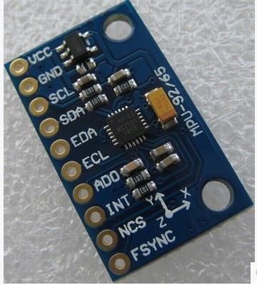

# MPU 92/65 9250 IMU

## MPU 9250 Device overview
http://www.invensense.com/products/motion-tracking/9-axis/  
Data sheets are available on this website

The MPU-925x™ family of parts are the world’s leading 9-axis MotionTracking devices designed for battery operated, high performance consumer electronics products.

The 9-axis product family incorporates the same market proven MotionFusion™ and run-time calibration that is supported in InvenSense’s market leading MPU-65xx family of products. This solution has shipped in millions of units and has been very well market validated.

9-Axis MotionTracking has become a key function in many consumer electronics devices including smartphones, tablets, and wearables. The size advantage of the integrated 9 axis devices versus a discrete solution is compelling for space constrained products such as smartphones and wearable sensors.

The MPU-925x devices combine a 3-axis gyroscope, 3-axis accelerometer and 3-axis compass in the same chip together with an onboard Digital Motion Processor™ (DMP™) capable of processing the complex MotionFusion algorithms.

## MPU 92/65 overview

http://vi.raptor.ebaydesc.com/ws/eBayISAPI.dll?ViewItemDescV4&item=271910672852&category=176973&pm=1&ds=0&t=1456674685313

Description:

    MPU-9250 module( 3 axis accelerator, 3 axis gyro and 3 axis magnetometer)
    Chip: MPU9250; Power voltage: 3~5V
    Communication mode: I2C / SPI; Gyro range: +/-250, +/-500, +/-1000, +/-2000dps
    Accelerator range: +/-2G, +/-4G, +/-8G, +/-16G
    Magnetometer range: +/-4800uF
    Pin spacing:2.54mm
    Size: 15mm*25mm (approx)

https://www.dropbox.com/s/jblho0sz2i5yxfo/manual.rar?dl=0

MPU 92/65

    MPU-9250 module( 3 axis accelerator, 3 axis gyro and 3 axis magnetometer)
    Chip: MPU9250; Power voltage: 3~5V
    Communication mode: I2C / SPI; Gyro range: +/-250, +/-500, +/-1000, +/-2000dps
    Accelerator range: +/-2G, +/-4G, +/-8G, +/-16G
    Magnetometer range: +/-4800uF
    Pin spacing:2.54mm
    Size: 15mm*25mm (approx)

## Projects

http://www.lucidarme.me/?p=5057   
This post presents a simple example of how to interface the MPU-9250 with an Arduino board. The breakout board used here is the IMU 9DOF - MPU9250 breakout board manufactured by Drotek.

https://github.com/kriswiner/MPU-9250/blob/master/MPU9250BasicAHRS.ino  
Arduino library for the MPU 9250
