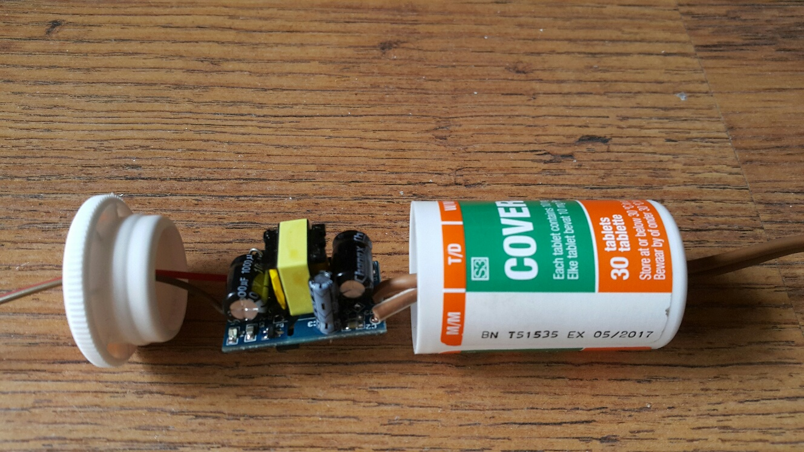

# 5V power supplies

## Introduction to switched mode power supplies

http://www.zl2pd.com/introSMPS.html  
http://www.zl2pd.com/fixedSMPS.html  
http://www.zl2pd.com/variableSMPS.html  

## Small power supply: 5V 700 mA

I bought a number of AC/DC 5V 700 mA switch mode power supplies for use with the ESP8622.  
<http://www.ebay.com/itm/AC-DC-5V-700mA-3-5W-Power-Supply-Buck-Converter-Step-Down-Module-for-Arduino-/281869225417>.  For safety reasons the module was encapsulated in a small tablet container.

These power supplies use the [EVERLIGHT  EL357N opto-coupler](http://www.futureelectronics.com/en/technologies/semiconductors/optoelectronics/isolation-components-optocouplers/Pages/4011071-EL357N-G.aspx?IM=0) and the [THX208 PWM Switching Power Supply Controller](http://www.datasheetcafe.com/thx208-datasheet-pdf-pwm-controller-thx/) PWM controller. A circuit diagram for these regulators are not available. It is however a very small PCB with only a few components.

The EBay web site tells the following: This power source for the isolation industrial-grade module power supply, temperature protection, over current protection and short circuit protection, high and low voltage isolation, AC 85V to 265 V input voltage, precision voltage stability DC 5V pm 0.2V output, ripple 60 mW. Overshoot max 10%. Output voltage rise time 100 mS max.  Small size, stable performance, cost-effective. Output current 700 mA (800 mA peak). 3.5 W. Working temperature:-20 ~ 60 C, Relative humidity 40 to 90%RH. Input Inrush Current: 20A. Output efficiency:80%. Size:3*2*1.8cm. Protection:
-  Output over power protection:YES ,recovery:Lock, restart after recovery
-  Short-circuit protection: YES, automatic recovery after problem solved
-  Temperature protection: YES,recovery:Lock, restart after recovery
-  Overcurrent protection: YES,recovery:Lock, restart after recovery
