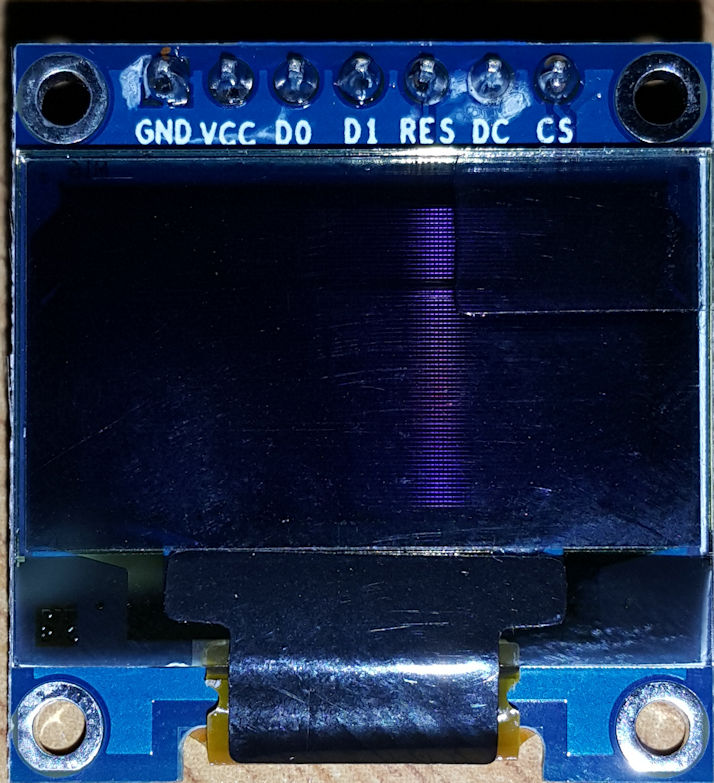
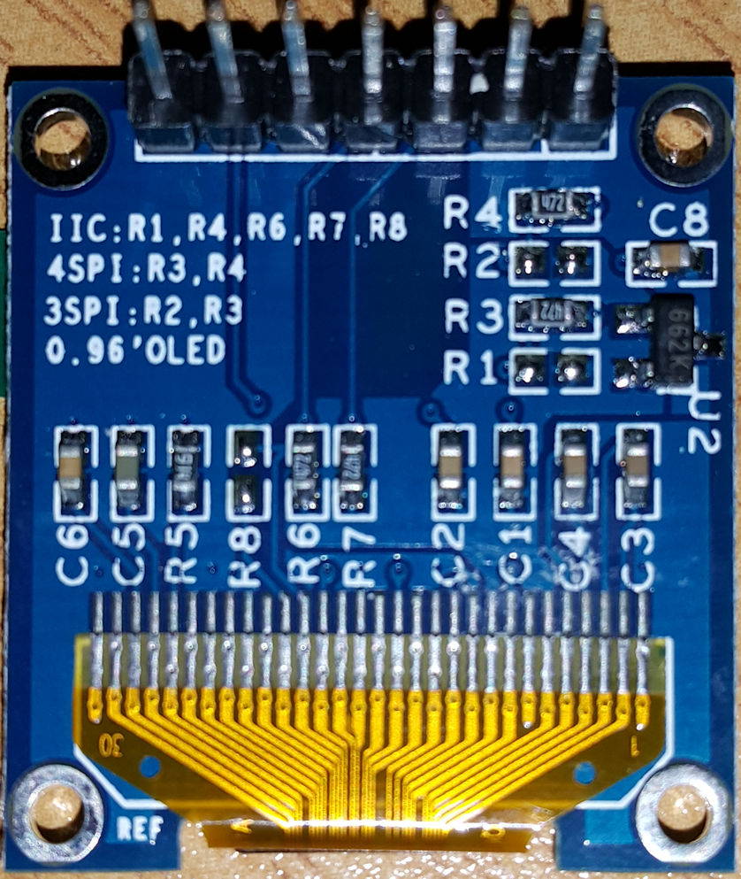

# 0.97 inch (7-pin) OLED SD1306 Driver

##Introduction

http://www.rhydolabz.com/displays-c-88/096-oled-display-module-spii2c-128x64-blue-p-2079.html

This is a 0.96 inch blue OLED display module (GMS096A). The display module can be interfaced with any microcontroller using SPI/IIC protocols. It is having a resolution of 128x64. The package includes display board,display, 7 pin male header presoldered to board. OLED (Organic Light-Emitting Diode) is a self light-emitting technology composed of a thin, multi-layered organic film placed between an anode and cathode. In contrast to LCD technology, OLED does not require a backlight. OLED possesses high application potential for virtually all types of displays and is regarded as the ultimate technology for the next generation of flat-panel displays.

OLEDs basic structure consists of organic materials positioned between the cathode and the anode, which is composed of electric conductive transparent Indium Tin Oxide (ITO). The organic materials compose a multi-layered thin film, which includes the Hole Transporting Layer (HTL), Emission Layer (EML) and the Electron Transporting Layer (ETL). By applying the appropriate electric voltage, holes and electrons are injected into the EML from the anode and the cathode, respectively. The holes and electrons combine inside the EML to form excitons, after which electro luminescence occurs. The transfer material, emission layer material and choice of electrode are the key factors that determine the quality of OLED components.

## Versions

There are three GMS096A versions: (1) 4-pin with I2C, (2) a 7-pin with SPI/I2C, and (3) the Adafruit 8-pin with SPI/I2C. Note that there are at east three different versions of the 7-pin module as well. The 7-pin version comes default in SPI mode but can be changed to work with I2C.

The Adafruit websites have good support information, but keep in mind that the board hardware details are not applicable to the 7-pin and 4-pin versions.

There are also 7-pin OLED displays with 89C52 controller ICs, but the one under discussion here has an SSD1306 driver chip.

- Need not backlight, the display unit can self-luminous
- High resolution: 128 * 64
- Viewing angle:> 160 °
- Ultra-low power consumption: full screen lit 0.08W
- Voltage: 3V ~ 5V DC
- Working Temperature: -30 c ~ 70 c
- I2C/IIC or SPI Interface
- Driver IC: SSD1306

The board I am playing with is this one:

## Connecting SPI or I2C

http://www.rhydolabz.com/displays-c-88/096-oled-display-module-spii2c-128x64-blue-p-2079.html

For the **SPI setup**, the module (GMS096A) comes in 4 wire SPI configuration by default and to make it work with the arduinos you can use these libraries from Adafruit.

For the **I2C setup** it demands a little bit of work on the module. Actually it was one of our customers who shared these simple configuration steps with us, start with resoldering the resistor from position R3 to R1 and then short the R8 resistor with some solder tin (0 Ohm resistor). The R6 and R7 pullup resistors are already soldered, nothing to do there. Once done, the module (GMS096A) is ready for I2C communication! The CS Pin is not necessarily needed, so just connect it to GND. The DC Pin selects the address. For standard address wire it to GND. The RES-pin needs a low pulse at startup and high voltage during operation (as in SPI mode), a 100nF capacitor to GND and a 10k res to VCC would be ideal!

## Libraries

### squix78/esp8266-oled-ssd1306

There are several libraries. This one https://github.com/squix78/esp8266-oled-ssd1306 is under active development and provides a nice infrastructure, such as a [font converter](http://oleddisplay.squix.ch/#/home). It supports both I2C and ISP interfaces as well as the SSD1306 and the SG1106 driver chips.   The library can draw lines and rectangle and circle shapes, draw [xbm images](http://blog.squix.org/2015/05/esp8266-nodemcu-how-to-create-xbm.html), and wrapping text in a variety of fonts.  

The libary can be installed in your PlatformIO project with

	platformio lib install 562

The [clock demo](https://github.com/squix78/esp8266-oled-ssd1306/blob/master/examples/SSD1306ClockDemo/SSD1306ClockDemo.ino) list the following pin connections to the ESP8266:

	// Use the corresponding display class:

	// Initialize the OLED display using SPI
	// D5 -> CLK
	// D7 -> MOSI (DOUT)
	// D0 -> RES
	// D2 -> DC
	// D8 -> CS
	// SSD1306Spi        display(D0, D2, D8);
	
	// Initialize the OLED display using brzo_i2c
	// D3 -> SDA
	// D4 -> SCL
	// SSD1306Brzo display(0x3c, D3, D5);
	
	// Initialize the OLED display using Wire library
	SSD1306 display(0x3c, D3, D5);

## Web resources

Nice example with nodeMCU (in I2C mode):  
http://arduino-er.blogspot.co.za/2016/04/nodemcu-esp8266-to-display-on-128x64.html   
http://arduino-er.blogspot.co.za/2016/04/hello-world-nodemcu-esp8266-128x64-i2c.html

https://www.adafruit.com/products/326 (similar, but not exactly the same).  
https://github.com/adafruit/Adafruit-128x64-Monochrome-OLED-PCB
https://github.com/adafruit/Adafruit_SSD1306 note the change for ESP8266
https://github.com/adafruit/Adafruit-GFX-Library a common set of graphics primitives (points, lines, circles, etc.)

http://forum.arduino.cc/index.php?topic=291283.0  
http://forum.arduino.cc/index.php?topic=289282.msg2028189  
http://forum.arduino.cc/index.php?topic=91395.0  

