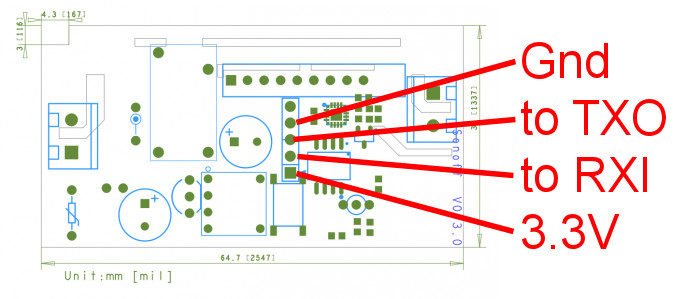
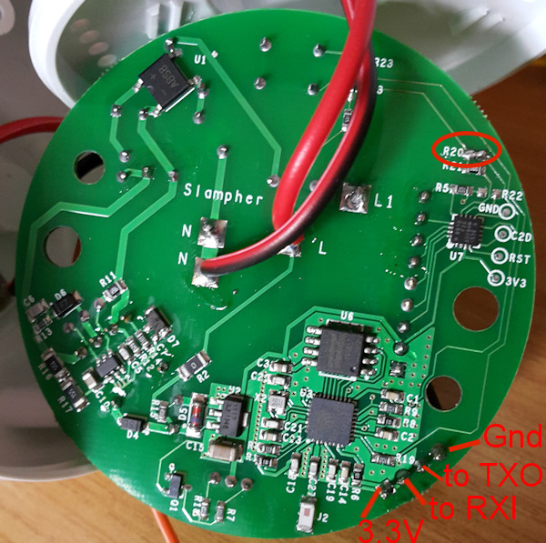
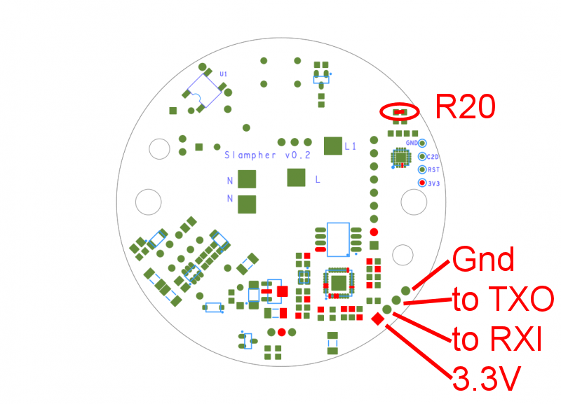

# ITead Studio

## Sonoff and Slampher

### Product description

The Sonoff/Slampher ESP8266 based switches are inexpensive wifi switches that can be used to control lights and other electric devices at up to 10 A for the Sonoff and 2 A for the Slampher - I would be careful with this rating though!.  The original Sonoff's had to be used with Itead's own cloud servers, but the more recent ones seem to work with Alexa as well.  What makes the Sonoff so attractive is that for simple light controllers, these can be reprogrammed (1 MB max memory) to use your own firmware. Also, you won't find homebuilt or commercial units at the same low price with the same functionality.  The build quality is quite acceptable and delivery times were relatively quick from China (I bought on two occasions thus far).  

https://www.itead.cc/sonoff-wifi-wireless-switch.html  
https://www.itead.cc/slampher.html

### Hardware connections
The PCBs are reasonably well documented by Itead themselves as well as by hobbyists on the internet.

http://tech.scargill.net/itead-slampher-and-sonoff/  
https://captain-slow.dk/2016/05/22/replacing-the-itead-sonoff-firmware/  
http://tinkerman.cat/new-firmware-for-the-slampher/  
https://phalox.be/wp/electronics/itead-sonoff-slampher-custom-firmware-fix/  
http://www.superhouse.tv/21-six-sonoff-secrets/  
https://www.itead.cc/wiki/Product  
https://www.itead.cc/wiki/Sonoff_Smart_Home_Solution  
https://www.itead.cc/wiki/Sonoff  
https://www.itead.cc/wiki/Slampher  
https://www.itead.cc/blog/user-guide-for-sonoff-slampher  

Reprogramming the switches requires some experience in Arduino or other controller programming. Also, the board comes equipped with four or five holes to which you must solder a four/five-pin header in order to connect the FTDI (serial programmer).  The pictures below show how the FTDI must be connected to the header pins. The RXI and TXO text means that these pins must be connected to the RXI and TXO pins on the FTDI.  Make sure to use a 3.3V FTDI, because the EPS8266 operates on 3.3V.  

The Slampher and RF Sonoff versions  require a small solder bridge on the PCB where R20 is marked (but not present on the board) For more details see https://phalox.be/wp/electronics/itead-sonoff-slampher-custom-firmware-fix/.  This solder bridge is required to enable the switch to be used as a frimware programming switch.  Note that if you permanently short out R20 you loose 433 RF control capability.  So if you require both 433 and wifi remove the bridge after programming.  Just keep in mind that the 433 control might confuse the on/off state on the wifi/MQTT side.  I decided to stick with wifi only so the bridges remain.

  
  
  

The more ambitious hobbyists increase the memory on the Sonoff, but Scargill warns that it is a delicate operation.  
http://tech.scargill.net/32mb-esp01/  
https://www.youtube.com/watch?v=8mz5sCAvDAY&feature=youtu.be  

When programming the firmware the power must be removed, the button pressed  and then the power must be re-applied while the button remains pressed. After a second or two release the button and start the download process. Search the Internet  for more information on programming the ESP8266. I use a separate power supply and do not rely on the FTDI power rail (the ground wire connects the power supply to the Sonoff as well as the FTDI. I found it was necessary to remove all power to the PCB: the external 3.3V supply as well as the FTDI programming pins. 

### Firmware sources

All the options describe below use the Home Assistant MQTT platform: https://home-assistant.io/components/switch.mqtt/.

You can write your own software, but there are at least two excellent open source products available.

- The https://github.com/KmanOz/Sonoff-HomeAssistant is a small and 'good enough' firmware. It is not overly complex and provide basic control home automation capability.   It has over the air (OTA) update capability. See also here: https://community.home-assistant.io/t/sonoff-homeassistant-alternative-firmware-for-sonoff-switches-for-use-with-mqtt-ha/2332

- The TASMOTA firmware https://github.com/arendst/Sonoff-Tasmota   provides a full set of capabilities, but it is much more complex to set up than KmanOz's firmware.  

- A MicroPython library is also available https://github.com/davea/sonoff-mqtt

I choose to use TASMOTA.  The TASMOTA wiki https://github.com/arendst/Sonoff-Tasmota/wiki  provides a detailed description of the firmware and how to configure it.  If you decide to use this firmware be sure to study the wiki in detail. 

See also the following:  
http://www.cnx-software.com/2017/02/27/karls-home-automation-project-part-1-home-assistant-yaml-mqtt-sonoff-and-xmas-lights/  
https://esp8266hints.wordpress.com/2016/04/10/using-theo-arends-sonoffmqtt-package-tasmota/  
https://esp8266hints.wordpress.com/2016/05/01/using-tasmota-part-2-mqtt/  

